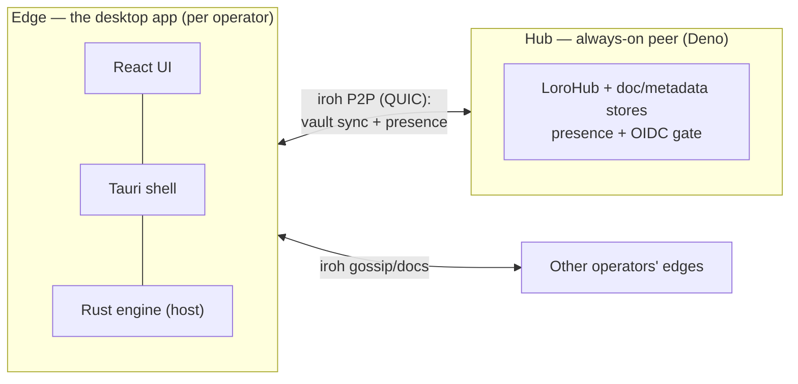
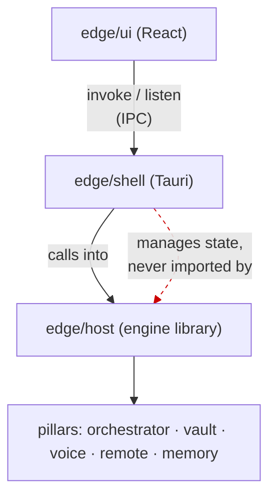
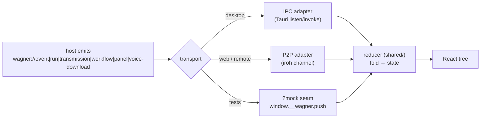
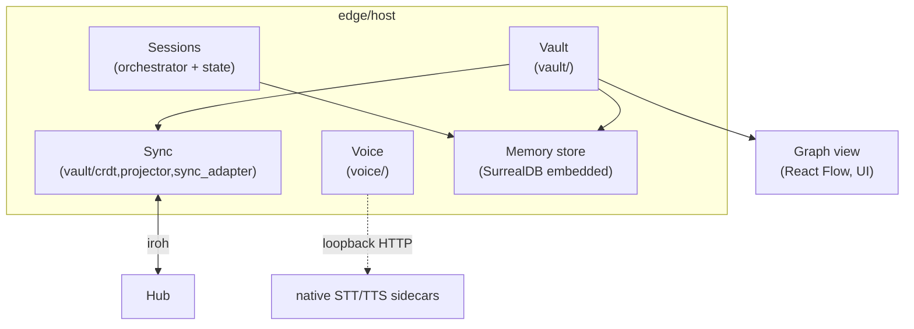
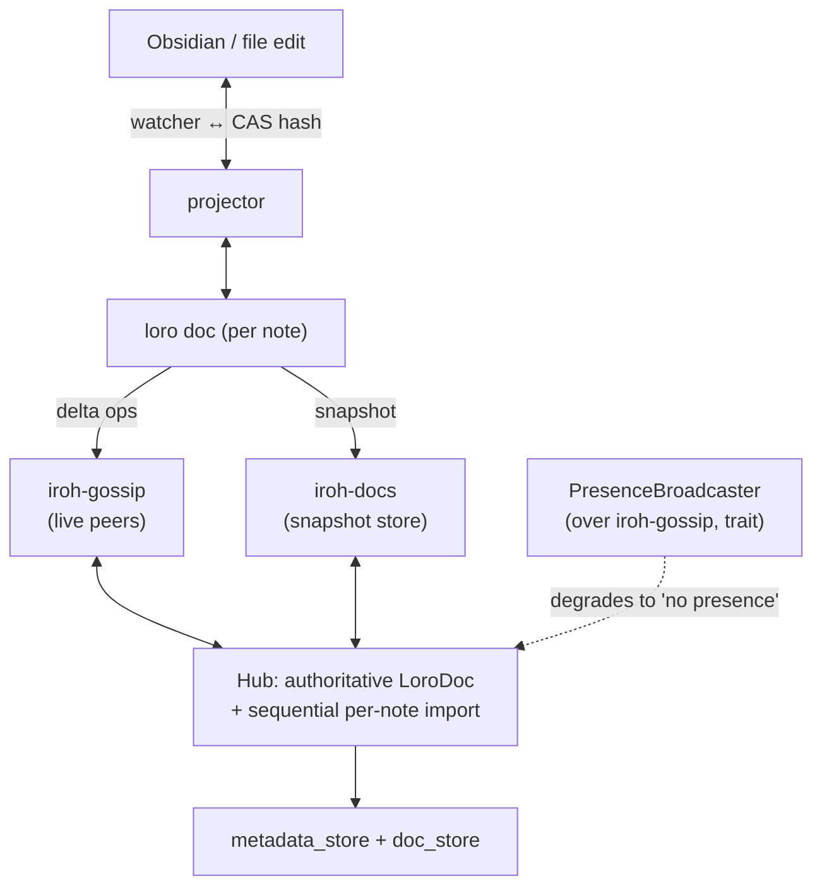
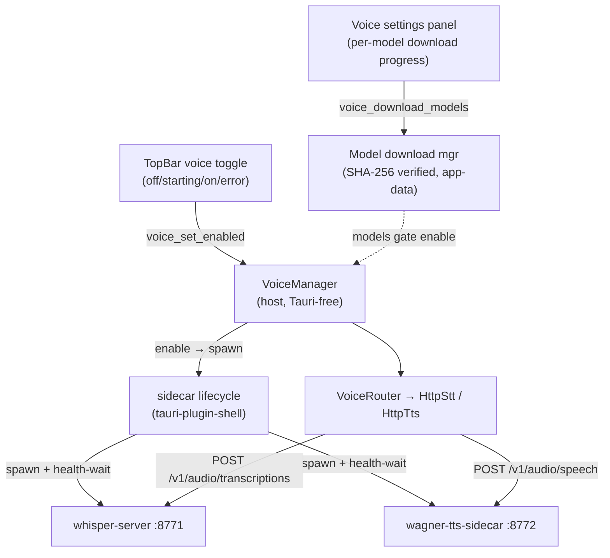
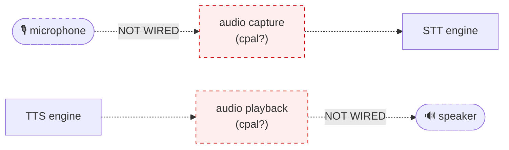

# Wagner — architecture

> Companion to `wagner-vision-and-architecture.md` (the *why*). This file is the
> *how*: the shipped structure, the dependency rules, and the data flow, with
> diagrams. Diagrams are Mermaid — they render as images on GitHub and in most
> markdown viewers.

## 1. One product, two layers

Wagner is a local-first personal OS for daily work: agents, deterministic
workflows, voice/text interaction, search/research, productivity connectors,
dedicated workspaces, and a shared vault knowledge graph. Coding is the first
heavy workspace, not the product boundary. **Edge executes, hub remembers.**



- **Edge** is the product surface: a single signed `.app` that runs agents and
  workflows, shows the operating picture/graph/workspaces, holds the local
  vault, and runs voice natively.
- **Hub** is a headless always-on peer that persists the shared vault and brokers
  multi-device or multi-teammate sync + presence. It does not sit on the local
  execution path.
- The link between them is **iroh** (QUIC P2P) — not HTTP request/response. The
  vault is a CRDT (loro); sync is gossip + a snapshot store.

## 2. Repo layout (monorepo, two layers)

```
wagner/
  edge/
    host/         # Rust engine — headless, Tauri-free. The brain.
    shell/        # Tauri 2 desktop shell — IPC, tray, lifecycle, bundling.
    ui/           # React UI (Vite) — console, graph, vault, voice.
    tts-sidecar/  # wagner-tts-sidecar — pure-Rust Kokoro TTS (misaki-rs + ort).
  hub/            # Deno + Hono always-on peer.
  shared/         # TS contracts: schemas/, reducer/, transport/.
  scripts/        # voice-sidecars.sh (dev stack), stage-voice-binaries.sh (bundle).
  docs/ adr/ specs/ memory/
```

**The cardinal rule (Constitution Article VII — one-directional dependency):**
`ui → shell → host → pillars`. The host **never** links Tauri; the engine builds
and tests headlessly with no shell, no hub, no network. This is what makes the
whole thing testable (and what keeps Article VI — edge autonomy — true).



## 3. The spine: event → reducer → projection

> **Deepened in [`runtime-architecture.md`](runtime-architecture.md):** the full participant bus (agents · connectors · scheduler as pub/sub participants), the strongly-typed envelope, participant identity, and the device / cloud / teams model. The goal loop is one participant there, not the center.

Everything the UI shows is a **projection of an event stream**. The host emits
typed events; a transport carries them; a transport-blind reducer folds them into
state the React tree renders. This is why the same UI works over IPC (desktop)
and over iroh (remote web client) with no change above the seam.



- **Schema-validated payloads (Article X):** Rust→TS event payloads are validated
  against JSON Schema (`edge/host/schemas/*.schema.json`) before emission, so shape
  drift is caught at the boundary, not silently in the frontend.
- **`?mock` seam:** the same reducer is driven by Playwright-pushed events in
  `make accept`'s headless UI journey — acceptance tests with no native shell.

## 4. The five pillars

> **Target runtime ([`runtime-architecture.md`](runtime-architecture.md)):** each
> pillar below becomes a **participant** on one typed event bus — and so do agents,
> connectors, and the scheduler. The goal loop is one participant, not the hub.
> The pillars are how the engine is *organized today*; the bus is how the parts
> *communicate* once `specs/011-runtime-foundation` lands. Durable state
> (CRDT + JSON) is unchanged by the move; only the in-process wiring becomes pub/sub.



| Pillar | Where | What |
|---|---|---|
| **Sessions** | `orchestrator/`, `state/`, shell `commands.rs` | Durable, concurrent, resumable autonomous runs. A `Run` *is* a session. A `bus::AgentRegistry` supervises live runs — start/abort/steer route through it; events carry `run_id`. The goal loop drives a pluggable `AgentPool` trait (→ deterministic tests with a fake agent). |
| **Vault** | `vault/` | Local knowledge base over `.wagner/memory`: frontmatter + a **deterministic** wikilink parser, typed links, backlinks, tiered retrieval, `_staging/` approval gate. |
| **Graph** | UI (React Flow) + `vault_graph` IPC | Visual browser of the vault graph; Console/Vault view tabs. |
| **Sync** | `vault/{crdt,projector,sync_adapter,snapshot_store}` | Distributed v1: **loro** CRDT per note + **iroh** gossip/docs + a file↔CRDT **projector**. The projector race (Obsidian write ↔ remote merge) is the hard part — guarded by CAS on last-projected hash. |
| **Voice** | `voice/` + `tts-sidecar/` + shell lifecycle | STT/TTS behind trait ports; native sidecars; in-app toggle; on-demand model download. **See §6 — local audio I/O is the open gap.** |

## 5. Sync data flow (the hard part)



Hub design choice: the hub's in-memory `LoroDoc` is the **authoritative merge**;
iroh-docs is only the snapshot store (resolves the iroh-docs-LWW vs loro-ordering
conflict). Presence is a thin broadcaster behind a trait → failures degrade
gracefully.

## 6. Voice subsystem — current state + the gap

What's **built and shipped** (native bundle lane, `specs/010`):



- Native, no Docker/Python/GPL. Binaries bundle via Tauri `externalBin`; models
  download on first enable (~165–240 MB) into app-data.
- OpenAI-compatible HTTP contract preserved → adapters barely changed.

**The gap (not yet built): real audio I/O.**



Today voice is an HTTP contract to local engines — there is **no microphone
capture and no speaker playback** (explicitly out of scope in `specs/010`). Until
that's wired, a person cannot speak to the agent and hear it back. This is local
device work (`cpal` or platform audio + a capture→STT→agent→TTS→playback loop),
**not** a networking problem — Iroh is irrelevant here (it only matters if voice
must cross the network, e.g. remote/teammate voice — a separate feature).

## 7. Security & trust boundaries

- **Privacy boundary (Article IX):** audio + text + vault stay local; voice only
  hits loopback (127.0.0.1) sidecars. Vault tiers gate what crosses to the hub.
- **Capabilities (least privilege):** the shell scopes `shell:allow-execute` to
  exactly the two named sidecars; no arbitrary process spawn from the webview.
- **Download integrity:** model files are SHA-256-verified on a `.partial` file
  *before* rename; `https_only` + redirect cap; symlinks rejected at the gate.
- **Hub auth:** OIDC employee gate (issuer/audience/email/group checks) + an
  Article-IX tier gate on vault writes.
- **Permission gate (Sessions):** a loopback MCP `--permission-prompt-tool` routes
  each agent tool-use to an in-app transmission the operator approves/denies.

## 8. Build, run, bundle

| Command | What |
|---|---|
| `make run` / `make down` | One-command dev stack: hub + voice sidecars + edge app. |
| `make verify` | Fast gate: clippy · cargo · shell · typecheck · ts · edge-build · hub. |
| `make accept` | `verify` + the headless `?mock` UI journey. |
| `make hub-e2e` / `make sync-e2e` | Hub HTTP E2E · live two-peer iroh sync (n0 relays). |
| `make voice-up` / `make voice-e2e` | Dev-stack sidecars · real-sidecar voice round-trip (`#[ignore]`). |
| `make edge-bundle` | Stage native binaries (target-triple) → `cargo tauri build` → `.app`. |
| `make gui-smoke` | Launch the real Tauri window, assert via macOS Accessibility. |

**Toolchains:** Rust (edge), Deno (hub), Node/Vite (ui + shared). Tests are
deterministic — the `AgentPool` trait + `?mock` transport seam mean no live CLI
or native shell is needed in CI.
