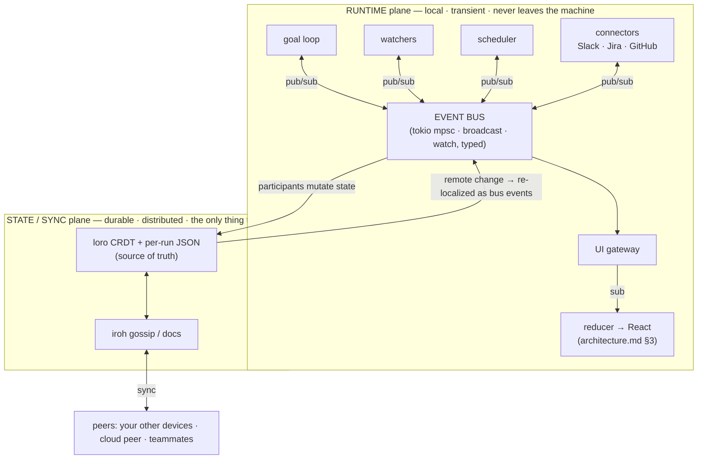
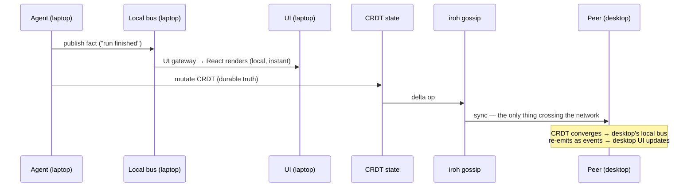
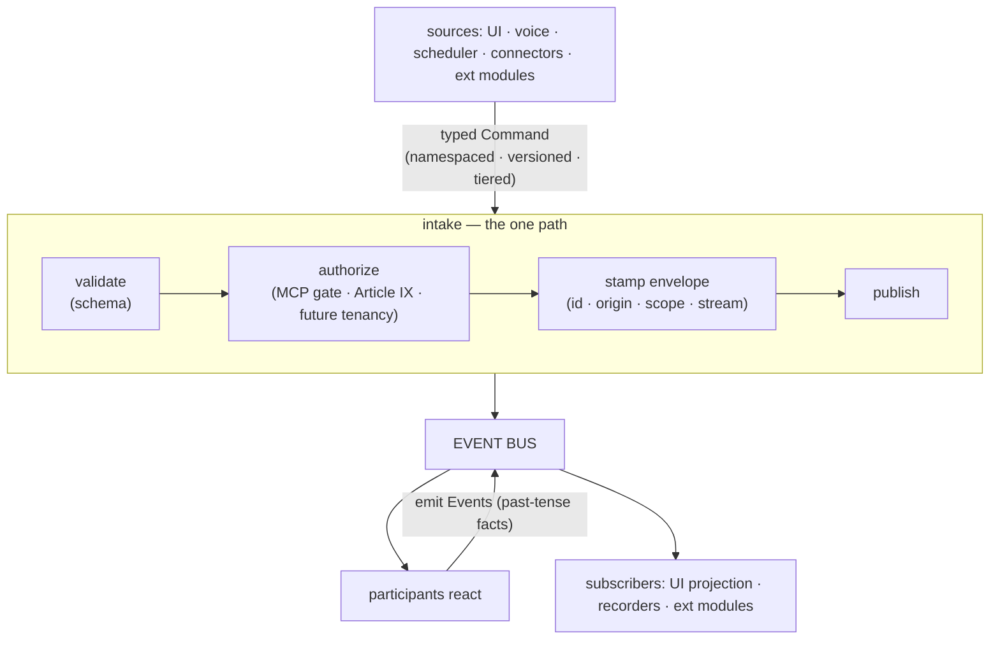
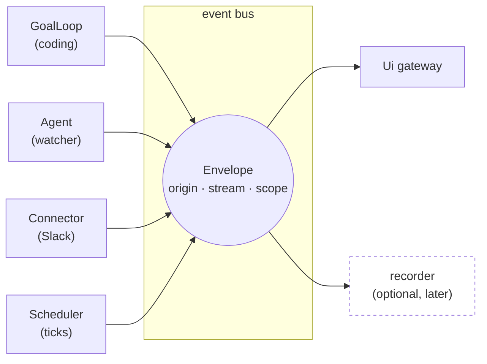
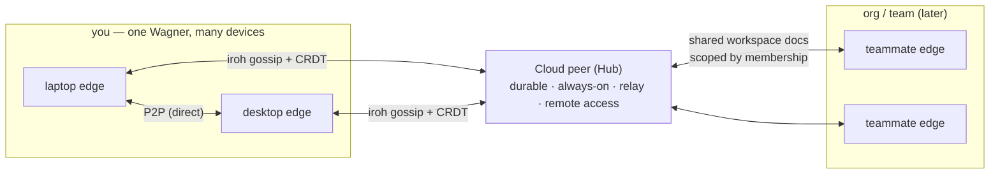

# Wagner — runtime architecture (the event bus & participants)

> Deepening of `architecture.md` §3 (event → reducer → projection).
> `architecture.md` is the shipped *how-overview*; **this** is the hardened design
> of the internal **event bus**, the **participant** model, and how Wagner stays
> "one Wagner" across devices, cloud, and teams. Diagrams are Mermaid (render on
> GitHub + most viewers). **Decisions here are LOCKED — changes go through review
> against this doc.**

## 0. Tenets (what we hold the build to)

1. **Local-first.** The runtime is in-process and **transient**. Durability and
   multi-device live in **synced CRDT state**, never in the bus.
2. **One spine, no center.** A single typed event bus. *Everything* —
   agents, connectors, the scheduler, the UI projection, the goal loop — is a
   pub/sub **participant**. Nothing is "the loop."
3. **Transient runtime ⊥ durable state.** The bus never persists and **never
   crosses the network**. loro CRDT over iroh gossip is the *only* thing that
   syncs (consistent with `architecture.md` §1/§5).
4. **Additive, not rewrite.** New capability = new participant or new peer.
   Event-sourcing, cloud execution, and teams are things you *add*, not
   re-architect.
5. **Strongly typed at the boundary** (Constitution Article X). The envelope is
   concrete; payloads are namespaced domain enums; generics only where they earn it.
6. **Right-sized.** No broker, no actor framework, no event-sourced/CQRS bus at
   single-user scale. See §6.
7. **It's a platform — the bus is a public contract.** The event + command
   taxonomy, the `Agent` trait, and the `Bus`/intake API are the surface other
   modules build on, internally *and* externally. Design them like an SDK:
   namespaced, stability-tiered, additively versioned, discoverable, and **open
   for extension without forking the core** (§2).

## 1. The two planes

The single most important idea: there are **two planes**, and **only one ever
touches the network.**



- **Runtime plane** — the event bus + participants, all in-process (tokio). Fast,
  ephemeral, machine-local.
- **State/sync plane** — loro CRDT (+ per-run JSON) is the source of truth; iroh
  gossip/docs is the transport. This is the *only* layer that crosses machines.
- **The seam between them:** a participant mutates CRDT state → the sync plane
  carries it to peers → each peer's *local* bus re-localizes that change into
  events for its own participants and UI. A "remote event" is just a CRDT change
  each node turns back into local events. **There is no distributed bus to build.**



This generalizes `architecture.md` §3: the transport-blind reducer/projection is
**one participant** (the UI gateway) on the local bus; a remote/web client consumes
that same projection over iroh, exactly as §3 already promises.

## 2. The event bus (local, transient)

A thin, typed `Bus` over tokio channels — **not** an actor framework, **not** a
broker:

| Need | Primitive | Why |
|---|---|---|
| Commands / point-to-point work | bounded `mpsc` | real backpressure |
| Fan-out notifications | `broadcast` | many subscribers; `Lagged` handled explicitly |
| "Latest state" for UI resync | `watch` | cheap re-sync after a gap |

The bus is exposed as a **typed interface** so participants never touch raw
channels (keeps it testable; keeps the transport swappable). Note: we are *not*
planning a networked bus — cross-machine is the sync plane. The interface is for
testability and optionality, not a roadmap item.

**The envelope is strongly typed** (Article X — payloads are JSON-Schema-validated
at the Rust→TS boundary):

```rust
/// Every message on the bus. Concrete envelope; the payload is a typed,
/// namespaced domain enum — never a loose blob.
#[derive(Clone, Debug, Serialize, Deserialize)]
pub struct Envelope {
    pub id: EventId,             // ULID — unique, sortable
    pub ts: Timestamp,
    pub origin: ParticipantId,   // WHO published it (see §3)
    pub stream: StreamId,        // ordering scope: run / agent / workspace
    pub seq: u64,                // monotonic per stream
    pub scope: Scope,            // owner + workspace — the multi-tenant seam (§5)
    pub payload: Event,          // the typed domain event
}

/// Namespaced, additive-only. Each variant lives in its own module.
#[derive(Clone, Debug, Serialize, Deserialize)]
pub enum Event {
    Goal(GoalEvent),
    Agent(AgentEvent),
    Integration(IntegrationEvent),
    Scheduler(SchedulerEvent),
    Vault(VaultEvent),
    Ui(UiEvent),
}
```

**Ordering & delivery:** per-stream ordering (`stream` + `seq`), best-effort,
at-most-once. **No global total order.** The UI recovers from a gap by re-syncing
from an authoritative snapshot (`get_initial_state` / `get_run_state`) — reusing
the CRDT/JSON state as the replay source, not a bus log.

### The taxonomy as a platform contract (DevEx)

Wagner is a platform: many modules — first-party and third-party — publish and
subscribe on this bus. The taxonomy is therefore a **public API**, designed like
an SDK, not an internal enum.

- **Two tiers — the core stays type-safe, extensions don't fork it:**
  - **Core** events/commands are concrete, namespaced Rust enums (`Goal`, `Run`,
    `Vault`, `Scheduler`, `Ui`, …) — compile-time exhaustive, JSON-Schema-exported
    (Article X) so TS/other consumers get generated typed bindings.
  - **Extension** events/commands carry their own namespace —
    `Event::Ext { ns, name, version, payload }` / `Command::Ext { … }` — where
    `payload` is validated against a JSON Schema the module **registers** at load.
    A new connector or agent ships its own events/commands **without a core PR**.
    *(Tradeoff: extension authors get boundary validation + their own typed
    payload, not compile-time core enum variants — the standard platform call.)*
- **Self-documenting names:** facts are **past-tense** (`RunFinished`, `PrOpened`);
  commands are **imperative** (`StartRun`, `PostMessage`).
- **Subscribe by topic/namespace + filter** (`vault.*`, `ext.slack.*`,
  `stream:<run_id>`) — never by matching a god-enum.
- **Stability tiers** on every type: `stable | experimental | internal`. External
  modules may rely only on `stable`; internals evolve freely.
- **Additive versioning:** only add fields (`Option<T>`), bump `version`; never
  break a `stable` type — schemas enforce it at the boundary.
- **Discoverable catalog:** the registered schemas (`edge/host/schemas/`) *are* the
  catalog — "what can I emit / subscribe to?" is introspectable, and the path to
  generated SDK bindings (TS first).

### Command intake — the one path in

Commands (intents) flow **in**; events (facts) flow **out**. Both use the same
typed / namespaced / tiered / extensible model — the two halves of the public
contract.



- **One `dispatch(Command) -> Result<Accepted>` entry.** Every source funnels
  through it, so "say it / click it / schedule it / connector-triggered it" are one
  path.
- **Pipeline:** validate → **authorize** (the single permission + future-tenancy
  chokepoint) → stamp envelope → publish to the bus.
- **Collapses the ~26 ad-hoc Tauri `#[command]` handlers** into one generic dispatch
  + typed command variants. (A few pure read-queries — e.g. `get_initial_state` for
  UI hydration — stay direct; all *actions* go through dispatch → bus.)
- **Extension commands are symmetric:** a module registers its command namespace and
  is the participant that handles them.

## 3. Participants & identity

**One `Agent` trait for every long-lived participant** — and a connector is *the
same trait*. This is what makes "create an agent" and "add an integration" the
identical move:

```rust
#[async_trait]
pub trait Agent: Send {
    fn name(&self) -> &str;
    fn subscriptions(&self) -> Vec<Subscription>;          // which events I want
    async fn init(&mut self, ctx: AgentContext) -> Result<()> { Ok(()) }
    async fn handle(&mut self, ev: Envelope, ctx: AgentContext) -> Result<()>;
    async fn shutdown(&mut self, ctx: AgentContext) -> Result<()> { Ok(()) }
}
// AgentContext hands each one { bus, state, scheduler, spawn }.
// Registered in an AgentRegistry (static today; a dynamic loader later goes
// through the same registry).
```

- The **goal loop is one `Agent`** — the one you reach for on a coding goal ("fix
  this bug"), which may fan out sub-agents/skills *under that goal*. This
  **supersedes `architecture.md` §4's framing** ("the goal loop drives the
  AgentPool"): the goal loop no longer sits at the center; `AgentPool` becomes how
  a *goal participant* fans out, not the app's spine.
- The **scheduler is one `Agent`** that emits `tick`/trigger events; time-based and
  event-triggered work are just participants reacting to those.
- The **UI gateway is one `Agent`** that subscribes and bridges to the reducer.

**Every participant has a stable, unique identity:**

```rust
#[derive(Clone, Debug, Serialize, Deserialize, PartialEq, Eq, Hash)]
pub struct ParticipantId {
    pub node: NodeId,            // iroh node identity (public key) — WHICH peer/machine
    pub kind: ParticipantKind,   // GoalLoop | Agent | Connector | Scheduler | Ui | System
    pub name: CompactString,     // stable logical name, e.g. "slack", "builder"
    pub instance: Ulid,          // this spawn/instance
}
```

`node` ties identity to the iroh peer key, so "the Slack connector on my laptop"
is distinct from "the same connector on the cloud peer." `ParticipantId` doubles
as the routing/scoping key.



## 4. The discipline: facts, not orders

Participants emit **facts** — "file changed," "PR opened," "build failed," "run
finished." They do **not** command each other. The goal loop is a *consumer of
facts* that decides goals and publishes intents; connectors react to intents.

This single rule is what stops the goal loop (or any participant) from quietly
becoming a god-orchestrator that knows about everyone — the exact failure we are
designing against. Corollaries:

- The goal loop never calls a connector directly. It publishes; the connector reacts.
- Connectors own their **own** retry/queue, so a slow or down integration never
  blocks the bus.
- Bounded queues + explicit overflow → "dozens at once" scales instead of
  ballooning memory or silently dropping the events you care about.

## 5. Staying "one Wagner" — devices, cloud, teams

All three are the **same mechanism**: peers syncing CRDT state over iroh gossip.
The runtime bus stays local on every node.



- **Multi-device, one Wagner** — your devices are peers; CRDT converges them;
  local-first, sync-when-connected.
- **Cloud = a durable, always-on peer** (the Hub, `architecture.md` §1): durability,
  relay, and reaching your own desktop/terminal remotely. Not a broker, not
  special — a peer that never sleeps. Remote control is a remote client subscribing
  to your edge's projection over iroh (§3 seam) and sending commands back through
  the same typed intake.
- **Teams/org** — teammates are peers; shared **workspace** CRDT docs scoped by
  membership; same gossip + CRDT. Single-user and org are the *same* path, scoped
  by `Scope { user, workspace }`.

## 6. What we deliberately do NOT build (non-goals)

These are the biggest over-engineering traps at single-user scale; **avoiding them
is a decision, not an omission** (grounded in the system-design research, 2026-06-18).

| Not building | Why | What we use instead |
|---|---|---|
| Message broker (NATS/Kafka) | distributed infra for a local app | iroh gossip + CRDT is the distribution layer |
| Actor framework (ractor/kameo/actix) | a 2nd concurrency model + crate lock-in for no gain at dozens-not-thousands scale | plain tokio + the `Bus`/`Agent` abstractions |
| Event-sourced / CQRS bus | CRDT+JSON are already the source of truth; full event-sourcing complicates every change | transient bus + durable CRDT; an opt-in **recorder participant** can be added later for run replay/audit — never as canonical state |
| Networked event bus | cross-machine is the sync plane's job | CRDT-over-gossip; the bus stays local |

## 7. Forward-compatibility seams (cheap now — hold them)

Bake these in from day one; they are near-free now and painful to retrofit:

1. **Events are plain serializable data** — serde-able, **no embedded
   `JoinHandle`/`AppHandle`/channel-senders/closures**. The day an event must be
   recorded or cross a wire, it already can. *(This is the one that bites if ignored.)*
2. **Envelope carries `origin` (ParticipantId) + `scope` (user/workspace) from day
   one** — multi-tenant later is a *subscription filter*, not a migration of every
   event and record.
3. **Bus stays behind a typed interface** — testability + the option to bridge.

Consequence: **the future is additive.** Event-sourcing later = add a recorder
participant. Cloud = add a peer. Teams = a scope filter + membership on CRDT docs.

## 8. How this evolves the shipped architecture (reconciliation)

- **Generalizes `architecture.md` §3.** Today the emit side is ~7 ad-hoc
  `app.emit` channels (`wagner://event|run|transmission|workflow|workflow-done|panel|voice-download`
  — per the engine recon). They unify into the one typed bus §3 always implied; the
  existing transport-blind reducer/projection becomes the UI participant on it.
- **Supersedes the §4 framing.** "The goal loop drives the AgentPool" → the goal
  loop is one participant; `AgentPool` is how a *goal participant* fans out.
- **Keeps everything else:** the one-directional dependency rule (Article VII),
  schema-validated payloads (Article X), iroh + CRDT sync (§5), Hub-as-peer (§1),
  the privacy boundary (Article IX).

## 9. Build sequence (high level)

1. **Types first** — `Bus` interface · `Envelope` · `ParticipantId` · the `Event`
   taxonomy (+ JSON Schemas). No behavior yet.
2. **Stand up the in-process bus**; route today's 7 emits through it. UI gateway
   subscribes → the existing reducer is unchanged. *(Pure consolidation; UI keeps working.)*
3. **`Agent` trait + registry**; move the goal loop behind it as one participant.
4. **Scheduler participant** (tick/trigger events) + the **first connector**
   (Slack or Jira) on the same trait — proving "new agent = new integration."
5. **React port** consumes the unified stream (the locked mocks are the target surfaces).
6. *(Later, additive)* recorder participant · cloud-peer hardening · teams scope.

## 10. Open questions

**Resolved 2026-06-18 (folded into §2):**
- **Event taxonomy** → two-tier (core enums + registered extension namespace),
  past-tense facts / imperative commands, stability tiers, subscribe-by-topic, a
  discoverable schema catalog. Designed as a public SDK surface.
- **Command intake** → one typed `dispatch` path (validate → authorize → stamp →
  publish); collapses the ad-hoc Tauri handlers; extension commands symmetric.
- **UI gateway vs. intake** → **two distinct participants**: intake is inbound
  (commands → bus), the UI gateway is outbound (bus → reducer/projection). Each
  stays single-purpose.

**Still open (decide during the build):**
- The concrete first cut of the core `Event`/`Command` enums — enumerated in
  Phase 1 of the build plan, from the 7 existing channels + the first connector.
- Whether the extension schema registry is compile-time (`inventory`-style) or
  load-time (config-discovered) for v1 — start compile-time; revisit when external
  plugins actually land.
