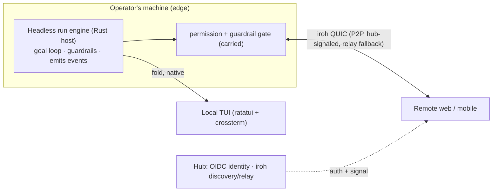

# Design: Edge Surface & Remote Sessions

**Status:** Brainstorm output (not yet specced). Date: 2026-06-15. Source: `/brainstorm` after the `001-shared-runs-and-learnings` wedge reached READY.

## Problem

The wedge carries the Tauri desktop GUI (Rust host + TS UI) as the edge surface. Two things to change:

1. **Local surface.** Engineers want a terminal-native daily driver, Windows support with **no terminal-emulation pain**, and not a fake terminal embedded in a GUI.
2. **Remote sessions, but with agency.** Claude Code's remote lets you *observe* a session; it does **not** let you run skills or run terminal commands remotely. Wagner should let an operator do — from a phone or browser — the same things they do locally: run a skill, run a command, see git diffs, read files. Not just see; *act*.

## Chosen approach

The run engine is already headless + event-sourced (post-wedge: the Rust host runs the goal loop and emits an append-only event stream; the pure reducer folds it with zero UI dependency — Article VIII). **The surface was never the engine — it's a thin projection of the event stream, and several can coexist.**

- **Local surface = native TUI** (Rust: `ratatui` + `crossterm`). Not an emulator — renders to the real terminal; first-class on Windows (crossterm handles ConPTY); reads the host's authoritative Rust state directly (no TS-reducer round-trip). The carried Tauri GUI is optional/retained, not the daily driver. **This is step one.**
- **Remote = model (a):** the run stays on the operator's machine; a remote client reaches *in*. Transport is **iroh QUIC** (authenticated Ed25519 node identity, encrypted, NAT-traversed P2P); the **hub** provides OIDC identity + iroh discovery/signaling + relay fallback. Mental model: "Tailscale for app-defined authenticated streams" — exposes scoped capability channels, not a whole-machine VPN.
- **Remote capability = tiers ① + ② (decision C):**
  - **① Run-control** — start/steer/answer-permission, run a skill or agent as a run step. (Already exists locally; remote = the same control messages over iroh.)
  - **② Dev context** — non-interactive commands (`npm test`, `git diff`/`status`), file read, file tree — piped stdout/stderr (the carried CLI runner already pipe-streams). **No PTY.**
  - **③ Raw interactive shell** — **not built into Wagner.** For the rare true-interactive need, `ssh`/`tmux` over the already-established iroh tunnel. Avoids cross-platform PTY + a browser terminal entirely.

## Key decisions

- **D1 — Headless engine, thin event-fold surfaces.** TUI / GUI / remote all fold the same stream; no engine change to add a surface. (Article VIII makes state a pure fold.)
- **D2 — Local surface = native TUI** (`ratatui`/`crossterm`), not the Tauri GUI and not an embedded terminal. Terminal-native, Windows-native, simpler than the GUI.
- **D3 — Remote transport = iroh QUIC P2P; run stays on the edge; hub = discovery/relay + OIDC.** Reaches the executing machine across NAT; keeps live run state off the hub (privacy); iroh's exact use case.
- **D4 — Remote capability = ① + ②; ③ via `ssh`/`tmux` over the tunnel, not rebuilt.** ①② ≈ 90% of "do what I do locally" with no PTY; ③ is the 20%/80% emulator-pain zone.
- **D5 — Remote-session lifecycle.** Optional; **armed on the edge machine** (the phone can never bootstrap its own access); SSO/JumpCloud-gated (OIDC, ADR-0002); **ephemeral** — a deliberate close tears down the tunnel (must re-arm); a transient network drop while still armed allows re-attach.
- **D6 — Every remote action routes through the carried permission + guardrail gate** and lands on the event log (free audit trail). Run-aware + guardrailed is the differentiator over raw SSH.

## Trade-offs accepted

- No native raw interactive terminal in the remote client (use `ssh`/`tmux` over the tunnel) — accepted to avoid PTY + xterm.js.
- Remote requires the operator's machine online + reachable (model a). Hybrid/cloud-exec deferred.
- Possibly two surface codebases (TS reducer + Tauri GUI alongside the Rust TUI). Mitigated: the GUI is optional and the engine state is the shared truth; the GUI may be retired.
- Live-event remote streaming crosses the privacy boundary (Article IX) → opt-in, edge-armed (consistent with D5).

## Open questions

- **Sequencing vs the READY wedge** (`001-shared-runs-and-learnings`): does TUI/remote come before, after, or alongside? This also decides whether the wedge's UI-touching tasks (T024a mark-shareable control, T030 recall surfacing in `edge/ui`) target the TUI or the carried GUI.
- Retire the Tauri GUI once the TUI lands, or keep it as an alternate surface?
- iroh relay: run our own, or use iroh's public relays for an internal-scale tool? (cost / latency / privacy)
- Tier ② file-read scope: any path, or repo-scoped? (guardrail policy)
- "Better than Claude" beyond ①②: remote multi-run fleet view, presence, shared-recall surfaced remotely — which land in the first remote slice?

---

## Resolved (2026-06-15 — engineer design session)

The surface and host model are now decided. This **supersedes D2's "local = native TUI" lead** and answers several open questions below. Captured as input to `/spec 002`.

- **R1 — Surface = GUI-primary, one codebase across desktop / web / mobile.** A single React/TS surface renders in a Tauri desktop shell, a browser, and mobile (responsive). Supersedes **D2** (TUI-primary). Rationale: a TUI can't reach web/mobile, so cross-environment reach forces the web GUI; and GUI-everywhere is *one* responsive codebase vs "TUI + a separate mobile surface" — fewer surfaces, not more. The same surface folds a local event stream (Tauri IPC) or a remote one (iroh), so "remote feels no different" falls out of D1 + the event-sourced spine. Designed with the **`impeccable`** skill; **`tui-design`** is the counterpart if the optional TUI is built later.
- **R2 — TUI demoted to optional/later** (answers "retire the Tauri GUI?"): **no** — the GUI becomes the cross-environment primary; a native terminal daily-driver may be added later (engine is surface-agnostic per D1, so both coexist), not now.
- **R3 — Host is native, never a browser.** A browser can't spawn the CLIs / touch the shell / read files, so the execution host is always a native process on the desktop machine; web/mobile are necessarily remote clients (instantiates model (a), D3).
- **R4 — Host lifecycle = embedded-first → tray-resident → daemon-later.** Step one: the host is embedded in the Tauri desktop app, which backgrounds to the **menu bar / system tray** (macOS `ActivationPolicy::Accessory`; close-to-tray via `WindowEvent::CloseRequested` → hide, not exit) so the host + iroh endpoint survive window-close and remote clients keep attaching. The headless daemon (the "both" endgame) is a later packaging step over the same Tauri-independent `platform/edge/host` crate — not a rewrite. (Refines D1.)
- **R5 — Capability split by host-reachability.** Hub-side features (browse shared memory, recall, fleet, presence) need no host and work on any surface. Host-side features (run-control ①, dev-context ②) require a reachable host over iroh. Web/mobile degrades gracefully: always the org-memory/observe client; the act-on-my-machine client when attached. (Confirms D4 — no embedded PTY; ③ via ssh/tmux.)
- **R6 — Tray as a product surface.** The menu-bar icon shows run status (idle / running / needs-you) and raises native notifications + a badge for permission prompts even with the window closed — serving long autonomous runs and the carried "never looks frozen" principle.

**Open questions now ANSWERED:** "Retire the Tauri GUI?" → no (R1/R2); TUI-vs-GUI and embedded-vs-daemon → R1–R4.

**Still open (for `/spec 002`):** iroh relay (own vs public); tier-② file-read scope (any-path vs repo-scoped guardrail); first-slice scope of the "better than Claude" capabilities. The operator capability set is **{browse shared memory, recall, fleet, presence (hub-side) · run-control, dev-context (host-side)}**; which land in slice one is the remaining call.

**Next:** design the GUI with **`impeccable`** (operator screens across desktop/web/mobile + the tray / needs-you surface), then `/spec 002` with the mockups as the UX baseline.
