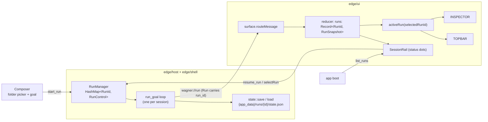
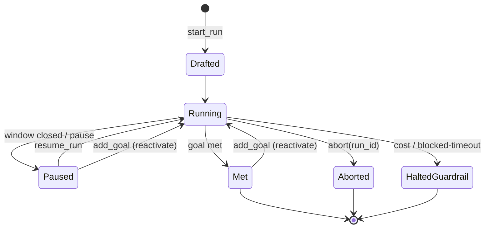

# Plan 003 — Durable, concurrent sessions + entry redesign (Wedge 1)

> Source: `handoff.md` §2/§4 (locked decisions), `docs/wagner-vision-and-architecture.md` §7/§8 (Phases 0–2).
> Baseline: `make verify` → exit 0 (231 cargo · 150 vitest · 28 deno; clippy/types clean). Verified at plan time.

## Overview

Today Wagner runs **one** agent run at a time: starting a new run silently
replaces the old one, and closing the window loses the ability to reopen it. This
plan turns a run into a **durable session** you can leave, come back to, run
several of at once, and steer over time — surfaced as a left **session rail**
with live status dots. It also redesigns the new-session screen to a native
folder picker + a single goal field, dropping the guardrails grid and the
test-command field (the target repo's own `CLAUDE.md`/`AGENTS.md` says how it
tests).

**Key framing decision: a Run *is* a session.** `Run` is already durable
(persisted every iteration to `{app_data}/runs/{id}/state.json`), resumable
(`state::load` + `RunStatus::Paused` exist), and bound to a goal. We add the
three fields it's missing (`project_dir`, `name`, `updated_at`, plus a `goals`
list) rather than inventing a separate `Session` entity on top. One aggregate,
no new abstraction.

## What ships

- **Engine:** `RunManager` holds many runs at once; resume/list/get/add-goal IPC
  commands; `Run` carries its folder, name, timestamp, and a goal list.
- **UI:** reducer holds a *map* of sessions; a session rail lists them with
  status dots and reopens any of them; the Composer is folder-picker + goal only.
- **Bug fix in scope:** `ipc.ts` invokes `wagner_${kind}` for control messages —
  the real commands are bare `steer`/`abort`/`answer_transmission`. Fixed here
  because this wedge touches the control path.

## Visual

### Component / data flow — single-run → many keyed sessions



### Session lifecycle (the state the rail's dots reflect)



Rail dot mapping: **running** = `Running`; **needs-you** = an open transmission
on that run; **idle** = `Drafted`/`Paused`; **done** = `Met`/`Aborted`/`HaltedGuardrail`.

## Prerequisites

- Green baseline (`make verify`). Re-run before starting.
- No new dependencies. `tauri-plugin-dialog` (Rust) + `@tauri-apps/plugin-dialog`
  (JS) are already deps with `dialog:default` capability granted.

## Dependency order

```
1 (Run fields+schema) ─┬─ 2 (RunManager map) ─┬─ 3 (list/get IPC) ─ 4 (resume IPC) ─ 5 (add_goal IPC)
                       │                       └─ 6 (ipc.ts fix + optional guardrails)
                       └────────────────────────── 7 (reducer runs map) ─ 8 (consumers) ─ 9 (Composer) ─ 10 (SessionRail)
```

Steps 1–6 are engine/Rust (+ the one TS control-path fix). Steps 7–10 are UI.
After **every** step the project builds and `make verify` is green.

---

## Step 1: `Run` becomes a session — add `project_dir`, `name`, `updated_at`, `goals`

**Why:** The rail must list sessions (folder + name + last-active time) without
loading every full run, and a session must accept goals added after creation.
These fields don't exist on `Run` yet, and `save()` validates against a JSON
schema, so the schema must learn them too or every write fails.

**What to implement:**
- `edge/host/src/state/run.rs`: add to `Run` — `project_dir: String`,
  `name: String`, `updated_at: String`, `goals: Vec<String>`. Extend `Run::new`
  to take `project_dir` + `name` and seed `goals` with the first goal. Keep the
  scalar `goal` field as the *current/primary* goal for back-compat with the loop
  (or derive it from `goals.last()` — pick one and note it; lazy choice: keep
  `goal` as the seed, `goals` as the append log).
- `edge/host/schemas/run-state.schema.json`: add the four fields. `updated_at`,
  `project_dir`, `name` required on write; `goals` defaults to `[]` on read so
  old on-disk runs still load.
- `edge/shell/src/commands.rs::start_run`: pass `project_dir` + a derived `name`
  (e.g. folder basename) into `Run::new`; stamp `updated_at` each save (the loop
  already saves every iteration — set `updated_at` there).
- `edge/ui/store/types.ts` `RunSnapshot`: mirror the new fields.

**Tests to write (RED first):**
- `run.rs`: `Run::new` seeds `goals` with the first goal; round-trips through
  `save`→`load` with the new fields (extend existing store tests).
- A schema test: an old-format run JSON (no `goals`) still validates/loads;
  a new run missing `project_dir` fails validation.

**Acceptance:**
- [ ] `Run` carries `project_dir`, `name`, `updated_at`, `goals`.
- [ ] Old run JSON without `goals` loads; new run without `project_dir` rejected.
- [ ] `make cargo` green.

**Rollback:** revert run.rs + schema; `goals`/`name`/etc. are additive.

---

## Step 2: `RunManager` holds many runs

**Why:** A single `Mutex<Option<RunControl>>` means launching session B kills
session A. Concurrent sessions need one control handle per run id.

**What to implement:**
- `edge/shell/src/commands.rs`: `RunManager.current: Mutex<Option<RunControl>>`
  → `runs: Mutex<HashMap<String, RunControl>>`.
- `start_run` / `start_workflow`: `insert(run_id, control)` instead of replacing.
  Drop the "abort previous" logic (that *was* the single-slot symptom).
- `abort(run_id: String)`: take + abort one entry (was: abort the only one).
- On loop completion, the task removes its own entry from the map (avoid leak).

**Tests to write (RED first):**
- A unit test on the map semantics: insert two ids, abort one, the other
  survives. (Extract the map mutation behind a tiny testable helper if the Tauri
  `State` makes direct testing awkward — keep it minimal.)

**Acceptance:**
- [ ] Two `start_run` calls yield two live entries.
- [ ] `abort(id)` ends only that run.
- [ ] `make cargo` + `make clippy` green.

**Rollback:** the map is a drop-in superset of the Option; revert to Option.

---

## Step 3: `list_runs` + `get_run` IPC

**Why:** The rail needs to show prior sessions after an app restart — those live
on disk, not in memory. `list_runs` reads them; `get_run` reopens one's detail.

**What to implement:**
- `edge/host/src/state/store.rs`: `list_summaries(runs_root) -> Vec<RunSummary>`
  reading `{app_data}/runs/*/state.json`, returning a light shape
  (`run_id, name, project_dir, status, updated_at, goal`) sorted by `updated_at`
  desc. `RunSummary` is a new small struct (keeps the rail off the full `Run`).
- `edge/shell/src/commands.rs`: `list_runs() -> Vec<RunSummary>` and
  `get_run(run_id) -> Run` (wraps `state::load`).
- Register both in the shell's `invoke_handler`.
- `edge/ui/app/bridge.ts`: `listRuns()` + `getRun(id)` helpers + `RunSummary` type.

**Tests to write (RED first):**
- `store.rs`: write 3 runs with different `updated_at`; `list_summaries` returns
  them newest-first with the light shape; a corrupt/partial dir is skipped, not
  fatal.

**Acceptance:**
- [ ] `list_runs` returns persisted sessions newest-first.
- [ ] A malformed run dir is skipped silently.
- [ ] `make cargo` green.

---

## Step 4: `resume_run` IPC — reopen a paused/closed session

**Why:** This is the payoff of durability: pick a session off the rail and it
keeps going. Resume is ~80% built — `load` + `Paused` exist; the missing piece
is a command that rebuilds the pool + gate and re-enters `run_goal`.

**What to implement:**
- `edge/shell/src/commands.rs`: `resume_run(app, mgr, reg, store, run_id)`:
  `state::load` the run → rebuild `CliAgentPool` (needs the persisted
  `project_dir` from Step 1) + the gate server → spawn the same loop closure
  `start_run` uses → `insert` into the RunManager map. Set status `Running`.
- Refactor the loop-spawn closure in `start_run` into a private helper
  (`spawn_run_loop(...)`) so `start_run` and `resume_run` share it — no copy.

**Tests to write (RED first):**
- An integration-style test (or a focused unit on the helper inputs): a saved
  `Paused` run resumes to `Running` and is present in the map. Reuse existing
  loop test scaffolding; don't spin a real CLI — assert the rebuild path, not a
  full agent turn.

**Acceptance:**
- [ ] A `Paused` run on disk resumes and re-enters the loop.
- [ ] `start_run` and `resume_run` share one loop-spawn helper (no duplication).
- [ ] `make cargo` + `make clippy` green.

**Rollback:** `resume_run` is additive; remove the command + helper extraction.

---

## Step 5: `add_goal` IPC — steer a session with new goals over time

**Why:** Locked decision §2: "add goals + steer over time." Steering augments
planning context but doesn't add a goal; a finished/paused session can't take new
work. `add_goal` appends a goal and reactivates the session.

**What to implement:**
- `edge/shell/src/commands.rs`: `add_goal(run_id, text)`: append to the live
  run's `goals`; if the run is `Paused`/`Met`, route through the Step-4 resume
  path to set it `Running` again. If it's already `Running`, the loop folds the
  new goal into the next planning pass (the planner reads `goals`).
- `edge/host` planning input: the planner concatenates/uses `goals` (the list)
  rather than only the single `goal`. Minimal: latest unmet goal wins; older
  goals stay as context.
- `// ponytail:` comment naming the ceiling — "goals are a flat append log folded
  into planning context; per-goal independent status/threading if a session ever
  needs goals to complete separately."

**Tests to write (RED first):**
- `run.rs`/loop: `add_goal` on a `Met` run appends and flips status toward
  `Running`; the planner input includes the appended goal.

**Acceptance:**
- [ ] `add_goal` appends and reactivates a finished/paused session.
- [ ] Planner sees the new goal.
- [ ] `make cargo` green.

---

## Step 6: Fix `ipc.ts` control-command names + make `start_run` guardrails optional

**Why:** `ipc.ts:51` invokes `wagner_${kind}` (e.g. `wagner_steer`) but the real
commands are `steer`/`abort`/`answer_transmission` — the desktop UI only works
because `bridge.ts` sidesteps `ipc.ts` and calls the real names. The P2P control
path (and resume-by-id) will route through `ipc.ts`, so fix it now. Separately,
making `guardrails` optional lets the redesigned Composer (Step 9) stop sending a
grid it no longer shows.

**What to implement:**
- `edge/ui/transport/ipc.ts`: map control `kind` → the real command name
  (`steer`, `abort`, `answer_transmission`) instead of `wagner_${kind}`.
- `edge/shell/src/commands.rs::start_run`: `guardrails: Option<GuardrailConfig>`
  with serde default → `Guardrails::defaults()` when absent.
- `edge/ui/app/bridge.ts`: drop `guardrails` from `StartRunInput` (Composer stops
  sending it).

**Tests to write (RED first):**
- `edge/ui/transport/ipc.test.ts`: a `steer` control message invokes `"steer"`,
  not `"wagner_steer"` (extend the existing IPC test).
- `commands.rs`: `start_run` with no guardrails uses defaults.

**Acceptance:**
- [ ] Control messages invoke real command names.
- [ ] `start_run` works with guardrails omitted.
- [ ] `make ts` + `make cargo` green.

---

## Step 7: Reducer — `run: RunSnapshot | null` → `runs: Record<RunId, RunSnapshot>`

**Why:** The UI can't show multiple sessions while it holds exactly one. The
event payload already carries `run_id`, so this is a pure reducer reshape plus
selectors — no transport/event change.

**What to implement:**
- `edge/ui/store/reducer.ts`: `WagnerState.run` → `runs: Record<string, RunSnapshot>`;
  `initialState.runs = {}`. Add `selectedRunId: string | null` (focused session).
- `applyRun(state, run)`: `runs[run.run_id] = run`. If no session is focused yet,
  focus this one (`selectedRunId ??= run.run_id`).
- New selectors: `activeRun(state)` (the focused session or null),
  `runList(state)` (values, sorted by `updated_at` desc), `selectRun(state, id)`.
- **Migrate** the existing assertions to the new shape (this is the deliberate
  contract change, not a regression): `reducer.test.ts:192/209/210`,
  `run_view.test.ts:67`, `p2p.test.ts:30` → read via `activeRun(state)` /
  `state.runs[id]`.

**Tests to write (RED first):**
- `reducer.test.ts`: two runs with different ids coexist in `runs`; `applyRun`
  updates one without clobbering the other; `activeRun` follows `selectedRunId`;
  first run auto-focuses.

**Acceptance:**
- [ ] Two sessions coexist in `state.runs`.
- [ ] Migrated tests assert the new shape and pass.
- [ ] `make ts` green.

**Rollback:** keep an `activeRun` selector either way, so components (Step 8)
don't care about the underlying shape — limits blast radius if reverted.

---

## Step 8: Point `App` / `TopBar` / `Inspector` at `activeRun`

**Why:** These three are the only `state.run` consumers (App.tsx:22, TopBar,
Inspector). They should render the *focused* session and let the rail change
focus.

**What to implement:**
- `edge/ui/app/App.tsx`: `const run = activeRun(state)`; thread `selectedRunId` +
  a `selectRun` handler down to the rail (Step 10). Composer shows when there is
  no session *or* the user clicks "New session" (existing `composing` flag).
- `TopBar.tsx` / `Inspector.tsx`: unchanged props (`run: RunSnapshot | null`);
  they already null-guard. Just receive `activeRun` instead of `state.run`.

**Tests to write:**
- Covered by Step 7 selectors + existing surface tests; add a focused-render
  assertion only if a gap appears.

**Acceptance:**
- [ ] App renders the focused session; switching focus re-renders.
- [ ] `make ts` + `make edge-ui` (UI smoke) green.

---

## Step 9: Composer redesign — native folder picker + goal only

**Why:** Locked §2: new session = pick a folder (native dialog) + type the first
goal. Drop the guardrails grid (max-iterations / cost-budget / blocked-timeout)
and the test-command field.

**What to implement:**
- `edge/ui/app/components/Composer.tsx`: remove `maxIter`, `costBudget`,
  `blockedTimeout`, `suite` state + their inputs. Replace the plain dir text
  input with a **"Choose folder…"** button calling
  `open({ directory: true })` from `@tauri-apps/plugin-dialog`; show the chosen
  path. Keep `goal` + the validate-dir check + preflight. `startRun` sends only
  `{ goal, projectDir, docs }` (guardrails omitted — Step 6).

**Tests to write (RED first):**
- Composer-level test (or extend UI smoke): launching with a picked folder +
  goal invokes `start_run` with no guardrails; the guardrail inputs are gone.

**Acceptance:**
- [ ] New-session screen is folder-picker + goal; no guardrails grid, no test field.
- [ ] Folder picker is the native dialog.
- [ ] `make ts` + `make edge-ui` green.

**Rollback:** Composer is self-contained; revert the component.

---

## Step 10: Session rail — list sessions, status dots, reopen

**Why:** The visible payoff: a left rail of every session with a live status dot,
click to focus/resume, and a "New session" button. On boot it calls `list_runs`
so prior sessions appear after a restart.

**What to implement:**
- `edge/ui/app/components/SessionRail.tsx`: render `runList(state)` (merged with
  `list_runs` results on boot); per row: name, folder basename, status dot
  (running / needs-you / idle / done per the lifecycle map above). Click a row →
  `selectRun(id)`; if its status is `Paused`/`Met` and not in memory, call
  `resume_run(id)` / `get_run(id)`. "New session" button → `composing = true`.
- Mount it in `App.tsx` `div.console` as a sibling above `OperativeRail`
  (operatives belong to the focused session; sessions are the outer axis).
- On app boot (`App` effect or `main.tsx`): call `cmd.listRuns()` and seed the
  reducer with summaries so the rail isn't empty before any live event.

**Tests to write (RED first):**
- A rail render test: given two summaries (one `Running`, one `Met`), it renders
  two rows with the right dot classes; clicking the `Met` row triggers
  `selectRun` (+ `resume_run` if reopened).

**Acceptance:**
- [ ] Rail lists in-memory + on-disk sessions with correct status dots.
- [ ] Clicking a closed session reopens it; "New session" opens the Composer.
- [ ] `make ts` + `make edge-ui` green.

---

## Verification (whole plan)

- [ ] `make verify` exit 0 (cargo + clippy + ts + typecheck + arch + vitest + hub).
- [ ] `make edge` launches; can: create a session (folder picker + goal), start a
      second concurrently, close + reopen one from the rail, add a goal to a
      finished session, abort one without touching the other.
- [ ] No new dependencies added.
- [ ] `ipc.ts` control path invokes real command names.

## Out of scope (deferred — named so they're not silently dropped)

- Vault wikilinks/graph/sync (Plan 004+; arch doc Phases 3–6).
- Voice (its own parallel plan).
- Per-goal independent lifecycle (Step 5 ceiling).
- `operative_id`→`agent` rename, `CostBudget` microdollars (handoff §9 polish).
