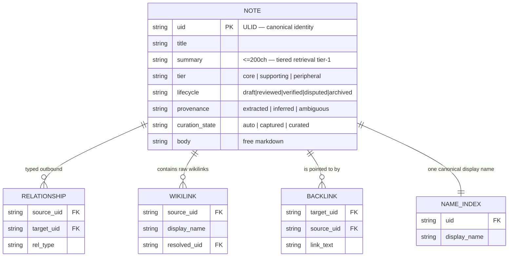

# Plan 004 — Vault v1: Wikilinks, Typed Relationships, and Backlinks

> Source: `docs/wagner-vision-and-architecture.md` §4 (Vault knowledge model), `handoff.md` §2/§3/§5, `build-context.md` §Roadmap.
> Baseline: `make verify` → exit 0. Re-run before starting.
> Parallel-capability: engine-only (`edge/host/src/`). Does not touch session UI (`edge/ui/`); can run in a git worktree concurrently with Plan 003. Land on `main` after Plan 003's first green commit so schema/struct conflicts are resolved.

## Overview

`edge/host/src/memory.rs` already implements a primitive vault: `MemoryStore` over embedded SurrealDB/SurrealKV, BM25 full-text index, and `write_markdown_projection` which dual-writes every learning as `.wagner/memory/<uid>.md` with YAML frontmatter. This is the vault kernel. **Vault v1 extends it — no rebuilding.**

Missing, per the locked design (vision §4, `handoff.md` §2):
1. Frontmatter is thin (`uid`, `project`, `tags`, `created`, `curation`) — nothing for `summary`, `tier`, `lifecycle`, `provenance`, typed `relationships`.
2. `[[wikilink]]` syntax is neither parsed nor indexed.
3. No backlinks index.
4. Retrieval is flat BM25 — no tiered read.
5. Notes land directly in `.wagner/memory/` with no human-approval gate.

**Determinism principle:** all link/backlink extraction is mechanical Rust (a real parser). The LLM is used only for semantic extraction (summary, tier, provenance) at write time — graph writes are code.

## Data model



Write path: `save_note()` → `parse_wikilinks(body)` (deterministic) → `resolve_names(name_index)` → write `wikilink` + `backlink` + `relationship` tables → `write_markdown_projection_v2()`.

## Prerequisites

- Green baseline (`make verify`).
- New Cargo deps (pure-Rust, add to `[workspace.dependencies]` + `edge/host/Cargo.toml`): `pulldown-cmark = "0.11"` (markdown/link parsing), `serde_yaml = "0.9"` (frontmatter round-trip). No frontend deps. No sync components.

## Dependency order

```
1 (NoteMetadata schema) ─ 2 (wikilink parser) ─ 3 (DB tables) ─ 4 (save_note_v2 write path)
   ├─ 5 (tiered retrieval) ─ 7 (BFS traversal) ─ 8 (vault_summary IPC)
   └─ 6 (_staging gate)
```

Steps 1–7 are pure `edge/host/src/`. Step 8 wires the Tauri command layer.

## Step 1: `NoteMetadata` — frontmatter schema upgrade

Add `NoteMetadata` (alongside `MemoryRecord`, not replacing — back-compat) with `summary: Option<String>` (≤200ch), `tier: Option<NoteTier>` (core/supporting/peripheral), `lifecycle: NoteLifecycle` (draft→reviewed→verified→disputed→archived), `provenance: Option<NoteProvenance>`, `relationships: Vec<RelationshipEntry>` where `RelType ∈ {extends,uses,implements,contradicts,derived_from,replaces,related_to}`. Extend `memory_markdown()` → `note_markdown()` (keep old name as alias) to emit all fields. Add `edge/host/schemas/note-frontmatter.schema.json`.

**Tests (RED first):** `note_markdown_includes_new_fields`; `note_markdown_backward_compat`; `rel_type_roundtrips_serde`; `lifecycle_ordering_is_valid`.
**Acceptance:** types compile + serde round-trip; YAML passes the schema; old callers compile; `make cargo` green.

## Step 2: `[[wikilink]]` parser — deterministic

New `edge/host/src/vault/mod.rs` (declare `pub mod vault;` in `lib.rs`) + `edge/host/src/vault/linker.rs`: `parse_wikilinks(body: &str) -> Vec<WikiLink>` where `WikiLink { display_name, alias: Option<String> }`. Use `pulldown-cmark` event stream; scan `[[...]]`. Handle `[[Name]]`, `[[actual|alias]]`, skip links inside code fences/inline code. Pure function, no I/O, no LLM.

**Tests (RED first, `edge/host/tests/unit/vault_linker.rs`):** simple/aliased extraction; code-fence + inline-code ignored; multiple links; no-links empty; safe on arbitrary UTF-8 (emoji/zero-width).
**Acceptance:** parser tests pass; no panics; `make cargo` green.

## Step 3: SurrealDB tables — wikilink, backlink, name_index, relationship

Extend `MemoryStore::open()` with `DEFINE TABLE IF NOT EXISTS` + covering indexes for `vault_wikilink` (source/target), `vault_backlink` (target/source), `vault_name_index` (uid UNIQUE, display_name UNIQUE), `vault_relationship` (source/target). Add stub methods: `upsert_name_index`, `resolve_name`, `write_wikilinks`, `write_backlinks`, `write_relationships`, `backlinks_for`.

**Tests (RED first, inline):** `name_index_upsert_and_resolve` (idempotent); `wikilinks_written_and_queryable`; `backlinks_for_resolves_inbound`.
**Acceptance:** tables created idempotently on `open()`; methods round-trip; `make cargo` green.

## Step 4: `save_note_v2` — unified write path

`MemoryStore::save_note(input, metadata, now, project_dir)`: (1) `save_memory` row insert; (2) upsert name_index `uid→title`; (3) `parse_wikilinks`; (4) `resolve_name` each link → `resolved_uid` or None; (5) `write_wikilinks` + `write_backlinks` + `write_relationships`; (6) `write_markdown_projection_v2` (full frontmatter). Keep old projection for un-upgraded callers.

**Tests (RED first):** `save_note_writes_all_tables`; `save_note_resolves_existing_link`; `save_note_unresolved_link_is_not_fatal`; `markdown_projection_v2_has_all_new_frontmatter_fields`; integration `edge/host/tests/integration/vault_write.rs::full_write_roundtrip` (3 inter-linked notes; backlinks resolve; `.md` files exist).
**Acceptance:** DB writes transactional, projection best-effort; no-wikilink body saves cleanly; `make cargo`+`make clippy` green.

## Step 5: Tiered retrieval API

Keep `recall`/`recall_block`. Add `tiered_query(TieredQuery { project_id, terms, limit }) -> Vec<TieredResult>` where `TieredResult ∈ {Summary, Section, Full, Related}`. Tier 1 = summary substring; tier 2 = first ~300ch after first heading; tier 3 = existing BM25 (`wagner_en`); tier 4 = 1-hop BFS over `vault_relationship` (`// ponytail:` ceiling — depth>1 speculative). Dedup across tiers; sort tier-1→4.

**Tests (RED first, inline):** `tiered_query_tier1_hits_summary`; `tiered_query_tier3_hits_body_bm25`; `tiered_query_tier4_bfs_one_hop`; `tiered_query_dedup`.
**Acceptance:** tier order, no dups, BFS 1-hop; `make cargo` green.

## Step 6: `_staging/` human-approval gate

Agent notes land in `.wagner/memory/_staging/<uid>.md` until approved. `write_markdown_projection_v2` gains `staging: bool`. Add `approve_staging_note(uid, project_dir)` (move file to curated path + set `curation_state`) and `list_staging(project_dir) -> Vec<String>`. `save_note` defaults `staging = true`. `// ponytail:` ceiling — single-note approval only; batch later.

**Tests (RED first, inline):** `staging_note_lands_in_staging_dir`; `approve_staging_moves_to_curated_dir`; `list_staging_returns_pending_uids`; `approve_nonexistent_uid_returns_error`.
**Acceptance:** staging default; approve moves file + updates DB; `make cargo` green.

## Step 7: BFS relationship traversal (extract + harden)

Extract `related_by_bfs(seed_uids, max_hops) -> Vec<MemoryRecord>` (walks `vault_relationship`, excludes seeds, cycle-safe). Used by `tiered_query` (max_hops=1); public for Plan 005 graph view.

**Tests (RED first, `edge/host/tests/unit/vault_bfs.rs`):** zero-hops empty; one-hop direct; two-hop transitive; cycles terminate; multi-seed deduped.
**Acceptance:** terminates on cycles; max_hops=0 empty; tiered_query delegates; `make cargo` green.

## Step 8: `vault_summary` IPC — expose vault to shell

`edge/shell/src/commands.rs`: `vault_summary(project_dir, query) -> Vec<TieredResultDto>` (uid, title, summary, tier_kind), `approve_staging(project_dir, uid) -> bool`, `list_staging(project_dir) -> Vec<String>`; register in `invoke_handler!`. `edge/ui/app/bridge.ts`: typed helpers. `edge/ui/store/types.ts`: `TieredResultDto`.

**Tests (RED first, `edge/host/tests/unit/vault_commands.rs` + `bridge.test.ts`):** DTO maps `Summary→"summary"`, `Related→"related"`; `vaultSummary` invokes `"vault_summary"`.
**Acceptance:** commands registered; bridge typed/tested; `make cargo`+`make clippy`+`make ts` green; `make verify` exit 0.

## Verification

`make verify` exit 0 after every step. End state: agent writes a note → lands in `_staging/` → `approve_staging_note` moves to curated → `vault_summary` returns it (tier-1 if summary matches, else tier-3). No regressions in existing memory tests or the 231 cargo baseline.

## Out of scope

loro/iroh sync (Phase 5); UUID→name rename rewrites (Phase 5); graph React component (Plan 005, consumes `related_by_bfs`); embedding/semantic search; hub sync (Phase 6); BFS depth>1 (ponytail ceiling); batch approve/reject (ceiling); voice (Plan 007).
