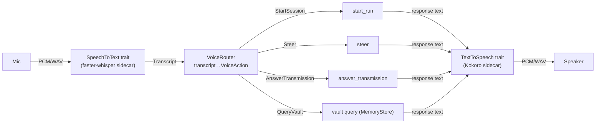

# Plan 007 — Voice: local JARVIS layer (faster-whisper STT + Kokoro TTS)

> Source: `handoff.md` §7 (Voice — first-class parallel pillar), `build-context.md` §Roadmap.
> Baseline: `make verify` → green (run before starting).
> **Fully parallel to all other work.** Touches only new files under `edge/host/src/voice/` + `Cargo.toml` test declarations. Never modifies `orchestrator/`, `cli/`, `remote/`, or any UI file. Build in a git worktree; merge to `main` after Phase A.

## Overview

Voice = "speak and it routes": operator speaks → engine hears, understands, maps to an existing Wagner action (start a session, steer the active one, answer a transmission, query the vault). All processing on-device.

**Pipeline:** mic → STT (faster-whisper) → router → action; action response text → TTS (Kokoro) → speaker.

**v1 scope (this plan):** the `voice/` module — trait-based swappable STT/TTS, a deterministic router, and a full test suite running entirely on fakes (no audio hardware, no Python).
**Not v1:** real faster-whisper/Kokoro subprocesses, mic capture, audio playback, UI widgets, Tauri IPC (Steps 8–11, deferred).

## Pipeline diagram



**Integration boundary — HTTP sidecar (decided).** faster-whisper-server and Kokoro both expose HTTP. The Rust voice module calls `http://127.0.0.1:{port}` via the existing `reqwest` (same pattern as `cli/endpoint.rs`). Sidecar launched separately (later step). In v1 the trait boundary IS the seam; both impls are fakes. Sidecar down → `HttpStt/TtsEngine` returns error; router logs and stays silent (graceful degrade).

## Prerequisites

- Green baseline. No new Rust deps for v1 (`reqwest`, `tokio`, `async-trait` already present). The `voice/` module is a pure library module in `wagner-edge-host`; it does NOT link Tauri (Article VI). IPC wiring deferred.

## Dependency order

```
1 (traits+types) ─ 2 (FakeStt) ─ 3 (FakeTts) ─ 4 (router rules) ─ 5 (router vault action)
   └─ 6 (VoicePipeline) ─ 7 (integration test, all-fake) = v1 DONE
8 (HTTP STT) ─ 9 (HTTP TTS) ─ 10 (sidecar mgr) ─ 11 (IPC) = OUT OF SCOPE
```

## Step 1: Module skeleton + core traits/types

New `edge/host/src/voice/mod.rs` + `types.rs`. `#[async_trait] SpeechToText::transcribe(&[u8]) -> Result<Transcript, VoiceError>`; `TextToSpeech::synthesize(&str) -> Result<Vec<u8>, VoiceError>`. `Transcript { text, confidence: f32 }`. `VoiceAction ∈ {StartSession{goal}, Steer{run_id:Option,instruction}, AnswerTransmission{transmission_id:Option,answer}, QueryVault{query}, Unknown{transcript}}` (derive Debug/Clone/PartialEq). `VoiceError` (thiserror: SidecarUnavailable/Transcription/Synthesis). Add `pub mod voice;` to `lib.rs`.

**Tests (RED):** compile-time use of `VoiceAction` variants (PartialEq/Clone).
**Acceptance:** files exist; types compile; `make cargo`+`make clippy` green.

## Step 2: `FakeStt`

`edge/host/src/voice/stt.rs`: `FakeStt { scripts: Mutex<VecDeque<String>> }` returns scripted transcripts (confidence 1.0); empty → `Err(Transcription)`.
**Tests:** `fake_stt_returns_scripted_transcript`; `fake_stt_wraps_empty`.
**Acceptance:** compiles, tests pass, `make cargo` green.

## Step 3: `FakeTts`

`edge/host/src/voice/tts.rs`: `FakeTts { calls: Mutex<Vec<String>> }`; `synthesize` records text, returns sentinel `b"FAKE_AUDIO"`; `calls()` for assertions.
**Tests:** `fake_tts_records_calls`; `fake_tts_returns_sentinel`.
**Acceptance:** compiles, tests pass, `make cargo` green.

## Step 4: `VoiceRouter` — transcript→action

`edge/host/src/voice/router.rs`: pure synchronous `route(&Transcript) -> VoiceAction`. Rules (case-insensitive, priority order), implemented with pure `std` string matching (`to_lowercase`/`splitn`/`starts_with` — no new dep; add `regex` only if patterns grow):
- `start|launch|open|begin <rest>` → `StartSession{goal:rest}`
- `steer|update|change|tell <rest>` → `Steer{run_id:None,instruction:rest}`
- `yes|no|allow|deny|approve|reject [rest]` → `AnswerTransmission{transmission_id:None,answer}`
- `search|find|look up|what is|what are <rest>` → `QueryVault{query:rest}`
- else → `Unknown{transcript}`

**Tests (RED):** start_session, steer, answer_yes, answer_deny, vault_query, unknown, case_insensitive (7).
**Acceptance:** all pass; `make cargo`+`make clippy` green.

## Step 5: Router `handle_action` (wires QueryVault to MemoryStore)

`handle_action(action, Option<&MemoryStore>) -> String` (async): QueryVault → `recall_block`; Start/Steer/Answer → confirmation string (real side-effects wired at Step 11 IPC); Unknown → "I didn't catch that."
**Tests (RED):** start confirmation contains goal; vault query with real `MemoryStore` on tempdir returns non-empty; unknown fallback.
**Acceptance:** compiles, 3 tests pass, `make cargo` green.

## Step 6: `VoicePipeline`

`edge/host/src/voice/pipeline.rs`: owns `Arc<dyn SpeechToText>`, `VoiceRouter`, `Arc<dyn TextToSpeech>`, `Option<Arc<MemoryStore>>`. `process_audio(&[u8]) -> Result<Vec<u8>, VoiceError>` (audio→transcript→action→response→audio). `process_text(&str) -> Result<(VoiceAction, Vec<u8>), VoiceError>`. Re-export from `mod.rs`.
**Acceptance:** compiles; `make cargo` green.

## Step 7: Integration test — full pipeline on fakes (v1 acceptance gate)

`edge/host/Cargo.toml`: `[[test]] name="voice_pipeline" path="tests/voice_pipeline.rs"`. Cases: start_session (FakeTts.calls contains "Starting session: …"); steer; answer_transmission; unknown_graceful (Ok, not Err); stt_error_propagates; process_text_returns_action.
**Acceptance:** 6 tests pass; no audio/Python/network; `make cargo`+`make clippy` green; `make verify` green. **This is v1 done.**

## Verification

`make verify` after Step 7 — all prior tests pass + new `voice_pipeline` (6 green). Isolated runs: `cargo test -p wagner-edge-host --test voice_pipeline`; `cargo test -p wagner-edge-host voice`.

## Out of scope (deferred)

`HttpSttEngine`/`HttpTtsEngine` (need running sidecars); sidecar lifecycle manager; mic capture (CPAL/CoreAudio); audio playback; Tauri IPC commands; UI widgets (push-to-talk/waveform); wake-word; local-model router fallback (Haiku via existing CLI endpoint — plug into `handle_action` when STT+IPC live).

## File index

New: `voice/{mod,types,stt,tts,router,pipeline}.rs`, `tests/voice_pipeline.rs`. Additive: `lib.rs` (`pub mod voice;`), `Cargo.toml` (one `[[test]]`).
