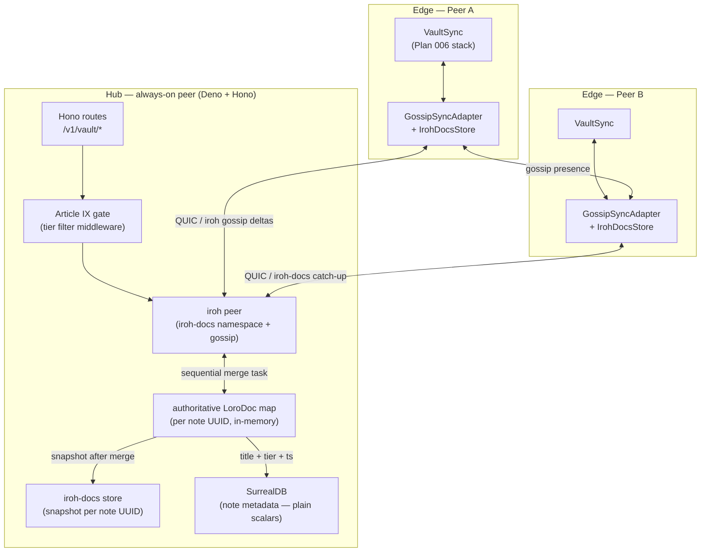

# Plan 008 — Hub vault store + multi-teammate sync + presence (Phase 6)

> Phase 6 of the roadmap. Prerequisite: Plan 006 (Distributed sync v1, Phase 5) fully
> committed and green. This plan activates the live iroh adapters and establishes the
> hub as the authoritative multi-peer sync point.
> Source: `docs/wagner-vision-and-architecture.md` §5/§9, `handoff.md` §5, ADR-0001,
> ADR-0003.
> Baseline: `make verify` → exit 0 + `make hub-e2e` → exit 0. Re-run before starting.

---

## Overview

Plan 006 wired `VaultSync` with in-memory stubs. **Plan 008 replaces those stubs**:
the hub (`hub/`) grows a vault API (Deno + Hono routes), an iroh-docs durable store
(catch-up snapshots keyed by note UUID), and an **authoritative in-memory `LoroDoc`**
— the single merge point that resolves the iroh-docs LWW-vs-loro ordering risk.

Key architectural decisions (locked):

- **Hub's `LoroDoc` is authoritative.** iroh-docs is only the snapshot store (see
  `docs/wagner-vision-and-architecture.md` §9 — "iroh-docs LWW vs loro ordering"
  risk). Per-note merges are applied sequentially on a per-note task to avoid races.
- **Article IX constraint.** Only curated notes + metadata ever reach the hub. Raw
  transcripts, agent diffs, and code blobs are explicitly blocked at the hub route
  layer. The edge is responsible for tier-filtering before sending; the hub is a
  second gate.
- **iroh Ed25519 peer identity.** The hub is an iroh peer. Edge peers connect via
  the iroh QUIC endpoint already established by ADR-0003. The hub's iroh node ID is
  registered in the discovery registry (existing `/v1/discovery/register` route).
- **Presence is best-effort.** Hub fans out iroh-gossip presence events to all
  connected peers; failures degrade to "no presence" with no error surface to the
  user.
- **SurrealDB plain-scalar constraint.** The hub uses SurrealDB (via ADR-0001).
  All stored fields are plain scalars. The loro snapshot bytes are stored as a
  base64-encoded string. The hub's iroh-docs store is the primary catch-up path;
  SurrealDB is used only for structured metadata (titles, tiers, timestamps).

The test strategy mirrors the existing pattern in `hub/tests/e2e/hub_server.test.ts`:
local JWKS OIDC stub, `port: 0` for hermetic allocation, real `fetch()` calls,
`srv.shutdown()` in finally. No external network.

---

## Architecture diagram



---

## New Deno dependencies

Add to `hub/deno.json` imports:

```json
{
  "loro-crdt": "npm:loro-crdt@^1",
  "base64": "jsr:@std/encoding@^1/base64"
}
```

No new npm packages beyond `loro-crdt`; iroh connectivity from the hub side is
handled via the Rust iroh binary spawned as a side-car process (see Out of scope for
the full iroh-Deno bridge — this plan uses the iroh-docs HTTP API via the local iroh
daemon, consistent with ADR-0003 relay strategy).

---

## New hub files (all under `hub/`)

```
hub/src/vault/
  article9.ts          Article IX tier-filter middleware
  doc_store.ts         iroh-docs HTTP client (catch-up snapshots)
  loro_hub.ts          authoritative in-memory LoroDoc map + merge queue
  metadata_store.ts    SurrealDB note metadata (plain scalars)
  routes.ts            Hono sub-app: /v1/vault/*
  presence.ts          iroh-gossip presence fan-out

hub/tests/e2e/
  vault_sync.test.ts   hermetic E2E (7-10 tests, same pattern as hub_server.test.ts)
```

---

## Step 1 — Article IX gate middleware

**What:** `hub/src/vault/article9.ts`. A Hono middleware that rejects any vault
request whose payload declares a non-curated tier. Curated tiers (from the Vault
spec): `"insight"` | `"decision"` | `"reference"`. Blocked: `"transcript"` |
`"diff"` | `"code"` | any unknown tier.

```typescript
// hub/src/vault/article9.ts
import type { Context, MiddlewareHandler } from "hono";

export const CURATED_TIERS = new Set(["insight", "decision", "reference"]);

export const article9Gate: MiddlewareHandler = async (c, next) => {
  const body = await c.req.json().catch(() => null);
  const tier: unknown = body?.tier;
  if (tier !== undefined && !CURATED_TIERS.has(tier as string)) {
    return c.json({ error: "Article IX: non-curated tier rejected", tier }, 403);
  }
  // Re-attach parsed body for downstream handlers.
  c.set("parsedBody", body);
  await next();
};
```

**Tests (RED first, `hub/tests/e2e/vault_sync.test.ts`):**
- `article9_rejects_transcript_tier` — POST with `tier: "transcript"` → 403.
- `article9_rejects_unknown_tier` — POST with `tier: "raw"` → 403.
- `article9_passes_insight_tier` — POST with `tier: "insight"` → passes to next
  handler (stub returns 200).

**Acceptance:** 3 tests green; `make hub-e2e` exits 0; middleware is a pure function
with no external deps (fast to import in unit tests too).

---

## Step 2 — In-memory authoritative `LoroDoc` map (`loro_hub.ts`)

**What:** `hub/src/vault/loro_hub.ts`. Maintains one `LoroDoc` per note UUID.
Merges are applied via a per-note async queue (a `Map<uuid, Promise<void>>`) to
guarantee sequential application and prevent concurrent merge races.

```typescript
// hub/src/vault/loro_hub.ts
import { LoroDoc } from "loro-crdt";

export class LoroHub {
  private docs = new Map<string, LoroDoc>();
  private queues = new Map<string, Promise<void>>();

  /** Apply an incoming loro update (bytes) to the authoritative doc for noteUid. */
  async applyUpdate(noteUid: string, updateBytes: Uint8Array): Promise<Uint8Array> {
    // Queue per-note to prevent concurrent merge races.
    const prev = this.queues.get(noteUid) ?? Promise.resolve();
    let snapshot!: Uint8Array;
    const next = prev.then(async () => {
      const doc = this.docs.get(noteUid) ?? new LoroDoc();
      doc.import(updateBytes);
      this.docs.set(noteUid, doc);
      snapshot = doc.exportSnapshot();
    });
    this.queues.set(noteUid, next);
    await next;
    return snapshot;
  }

  /** Export the current snapshot for noteUid, or null if unseen. */
  getSnapshot(noteUid: string): Uint8Array | null {
    const doc = this.docs.get(noteUid);
    return doc ? doc.exportSnapshot() : null;
  }

  /** Number of notes currently held. */
  get size(): number { return this.docs.size; }
}
```

**Tests (inline unit tests in `hub/tests/e2e/vault_sync.test.ts` or a separate
`hub/tests/unit/loro_hub.test.ts`):**
- `loro_hub_apply_creates_doc` — apply a loro snapshot; `getSnapshot` returns
  non-null bytes.
- `loro_hub_concurrent_merges_converge` — two concurrent `applyUpdate` calls on the
  same note UUID (simulated via two deltas from separate in-memory `LoroDoc`
  instances); after both settle, `getSnapshot` decodes to a document containing both
  edits.
- `loro_hub_sequential_queue_prevents_race` — 10 concurrent `applyUpdate` calls; no
  throw, final doc not corrupted.

**Acceptance:** tests green; no top-level `await` outside the queue chain; `make
hub-e2e` exits 0.

---

## Step 3 — iroh-docs snapshot store client (`doc_store.ts`)

**What:** `hub/src/vault/doc_store.ts`. HTTP client wrapping the local iroh daemon's
iroh-docs REST API. Stores/retrieves base64-encoded loro snapshots keyed by note UUID.
Behind a `SnapshotStore` interface so tests can inject a memory stub.

```typescript
// hub/src/vault/doc_store.ts

export interface SnapshotStore {
  put(noteUid: string, snapshotB64: string): Promise<void>;
  get(noteUid: string): Promise<string | null>;
}

/** In-memory stub — used in hermetic tests. */
export class MemorySnapshotStore implements SnapshotStore {
  private m = new Map<string, string>();
  async put(k: string, v: string) { this.m.set(k, v); }
  async get(k: string) { return this.m.get(k) ?? null; }
}

/** Live client — calls the iroh daemon's HTTP API. */
export class IrohDocsStore implements SnapshotStore {
  constructor(private baseUrl: string, private namespace: string) {}
  async put(noteUid: string, snapshotB64: string) { /* HTTP PUT */ }
  async get(noteUid: string): Promise<string | null> { /* HTTP GET, null on 404 */ }
}
```

**Tests (RED first, `hub/tests/e2e/vault_sync.test.ts`):**
- `snapshot_store_put_get_roundtrip` — `MemorySnapshotStore`: put then get returns
  the same string.
- `snapshot_store_missing_returns_null`
- `snapshot_store_overwrite_replaces` — second put overwrites.

**Acceptance:** 3 tests green; `IrohDocsStore` compiles (no unit test — integration
only; iroh daemon not available in hermetic tests); `make hub-e2e` exits 0.

---

## Step 4 — Note metadata store (`metadata_store.ts`)

**What:** `hub/src/vault/metadata_store.ts`. Writes note metadata to SurrealDB after
each authoritative merge. **All fields are plain scalars** (SurrealDB 2.x constraint).
No nested objects, no arrays of objects, no enums.

```typescript
// hub/src/vault/metadata_store.ts
export interface NoteMetaRow {
  note_uid: string;          // plain string (PK)
  title: string;
  tier: string;              // plain string, not an enum
  owner_id: string;
  updated_at: number;        // Unix epoch ms, plain number
  snapshot_b64: string;      // base64 loro snapshot, plain string
}

export interface MetadataStore {
  upsert(row: NoteMetaRow): Promise<void>;
  get(noteUid: string): Promise<NoteMetaRow | null>;
}

export class MemoryMetadataStore implements MetadataStore {
  private m = new Map<string, NoteMetaRow>();
  async upsert(r: NoteMetaRow) { this.m.set(r.note_uid, r); }
  async get(k: string) { return this.m.get(k) ?? null; }
}
```

The live `SurrealMetadataStore` implementation wraps the SurrealDB HTTP API (the hub
already configures SurrealDB via ADR-0001; reuse the existing connection pattern).

**Tests (RED first, `hub/tests/e2e/vault_sync.test.ts`):**
- `metadata_store_upsert_and_get` — round-trip via `MemoryMetadataStore`.
- `metadata_store_upsert_replaces` — second upsert with same `note_uid` overwrites.
- `metadata_store_missing_returns_null`

**Acceptance:** tests green; `make hub-e2e` exits 0; all fields in `NoteMetaRow` are
plain scalars (enforced via TypeScript type — no `Record<>`, no union types, no
optional nested objects).

---

## Step 5 — `/v1/vault/*` Hono routes

**What:** `hub/src/vault/routes.ts`. Mounts the vault sub-app into the existing Hono
app via `app.route('/v1/vault', vaultRoutes)` in `hub/src/app.ts`. Two routes:

```
POST /v1/vault/notes/:uid/update
  Body: { tier: string, update_b64: string, title?: string }
  1. Article IX gate (middleware from Step 1)
  2. Decode update_b64 → Uint8Array
  3. LoroHub.applyUpdate(uid, bytes) → snapshot bytes
  4. SnapshotStore.put(uid, base64(snapshot))
  5. MetadataStore.upsert({ note_uid, title, tier, owner_id, updated_at, snapshot_b64 })
  6. Return { status: "merged", note_uid, snapshot_b64 }

GET /v1/vault/notes/:uid/snapshot
  1. SnapshotStore.get(uid) → base64 string or null
  2. If null → 404
  3. Return { note_uid, snapshot_b64 }
```

Both routes are behind the existing `bearerAuth` OIDC middleware (inherited from
`/v1/*` in `hub/src/app.ts`). The `owner_id` is extracted from the JWT `sub` claim
(same pattern as `whoami`).

**Files:**
- `hub/src/vault/routes.ts` (new)
- `hub/src/vault/article9.ts` (from Step 1)
- `hub/src/app.ts` (extend: mount `vaultRoutes` at `/v1/vault`)

**Tests (RED first, `hub/tests/e2e/vault_sync.test.ts`, real HTTP fetch, memory deps):**
- `vault_update_without_auth_returns_401`
- `vault_update_with_curated_tier_returns_merged` — valid JWT, `tier: "insight"`,
  valid loro snapshot bytes as base64; response `status === "merged"`.
- `vault_update_with_transcript_tier_returns_403` — Article IX gate fires.
- `vault_snapshot_get_after_update_returns_bytes` — update then GET; snapshot_b64
  non-empty.
- `vault_snapshot_get_unknown_uid_returns_404`

**Acceptance:** 5 E2E tests green (all hermetic — no real iroh daemon, no real
SurrealDB; `MemorySnapshotStore` + `MemoryMetadataStore` injected via `AppDeps`
extension); `make hub-e2e` exits 0; the existing 7 hub tests remain green.

---

## Step 6 — Presence fan-out (`presence.ts`)

**What:** `hub/src/vault/presence.ts`. The hub subscribes to iroh-gossip presence
topics (one per active note UUID) and fans them out to all connected edge peers.
Implemented as a best-effort background task; errors are logged and dropped, not
surfaced to the caller.

```typescript
// hub/src/vault/presence.ts
export interface PresenceFanout {
  /** Announce that peerId is editing noteUid. Best-effort. */
  announce(peerId: string, noteUid: string): Promise<void>;
  /** Subscribe to presence events for noteUid. */
  subscribe(noteUid: string, cb: (peerId: string) => void): () => void;
}

/** No-op implementation — used when iroh daemon is unavailable. */
export class NoopPresenceFanout implements PresenceFanout {
  async announce() {}
  subscribe(_: string, __: (p: string) => void) { return () => {}; }
}

/** In-memory fan-out for tests. */
export class MemoryPresenceFanout implements PresenceFanout {
  private subs = new Map<string, Set<(p: string) => void>>();
  async announce(peerId: string, noteUid: string) {
    this.subs.get(noteUid)?.forEach(cb => cb(peerId));
  }
  subscribe(noteUid: string, cb: (p: string) => void) {
    if (!this.subs.has(noteUid)) this.subs.set(noteUid, new Set());
    this.subs.get(noteUid)!.add(cb);
    return () => this.subs.get(noteUid)?.delete(cb);
  }
}
```

Add `POST /v1/vault/notes/:uid/presence` route (behind `bearerAuth`):
- Body: `{ peer_id: string }` (peer announces itself as editing this note).
- Calls `PresenceFanout.announce(peer_id, uid)`. Returns `{ status: "ok" }`.
- Failures are swallowed; the route always returns 200 unless auth fails.

**Tests (RED first, `hub/tests/e2e/vault_sync.test.ts`):**
- `presence_announce_returns_ok` — valid JWT + body; response `status === "ok"`.
- `memory_presence_fan_out_delivers_to_subscriber` — subscribe, announce, assert
  callback called with correct `peerId` (unit test via `MemoryPresenceFanout`).
- `noop_presence_never_throws` — `NoopPresenceFanout.announce()` resolves without
  error.

**Acceptance:** 3 tests green; `make hub-e2e` exits 0; presence errors never
propagate to the HTTP response layer.

---

## Step 7 — Wire live iroh adapters into edge `VaultSync`

**What:** Replace `MemorySyncAdapter` + `MemorySnapshotStore` + `NoopPresence` in the
Tauri `sync_vault_init` command (Plan 006, Step 10) with the live iroh-backed
implementations from Plan 006's `GossipSyncAdapter` and `IrohDocsStore`. This is the
final integration step that makes peer-to-peer sync functional end-to-end.

The hub's iroh node ID is fetched from `GET /v1/discovery/resolve` (existing route)
after the hub registers itself at startup via `POST /v1/discovery/register`.

**Files:**
- `edge/host/src/vault/sync.rs` — implement `GossipSyncAdapter` (replace `todo!()`)
- `edge/host/src/vault/sync.rs` — implement `IrohDocsStore` (replace `todo!()`)
- `edge/shell/src/commands.rs` — `sync_vault_init`: swap in live adapters based on
  config; keep `MemorySyncAdapter` path behind a `#[cfg(test)]` feature flag.
- `edge/host/tests/integration/vault_sync_live.rs` (new) — integration test that
  connects two in-process iroh nodes (no relay, loopback), sends a loro delta, and
  verifies it arrives at the second node. Uses `LoopbackStream` from
  `edge/host/src/remote/endpoint.rs`.

**Tests (RED first):**
```rust
// edge/host/tests/integration/vault_sync_live.rs
#[tokio::test]
async fn two_iroh_peers_exchange_loro_delta_in_memory() {
    // Build two iroh Endpoints using iroh::Endpoint::builder() with no relay.
    // Connect peer B to peer A's node address.
    // GossipSyncAdapter on A broadcasts a loro delta for note "uid-1".
    // GossipSyncAdapter on B subscribed to "uid-1" receives it within 2s.
    // Assert received bytes match sent bytes.
    /* ... */
}
```

**Acceptance:** live iroh integration test green (in-process, no relay, no external
network); `make cargo` exits 0; the hermetic path (memory adapters) remains the
default for all other tests; `make verify` exits 0.

---

## Dependency order summary

```
1 (Article IX gate) → 5 (routes, depends on 1 + 2 + 3 + 4)
2 (LoroHub)         ↗
3 (SnapshotStore)   ↗
4 (MetadataStore)   ↗
                         → 6 (presence route, parallel to 5)
                                  → 7 (wire live iroh in edge — final integration)
```

Steps 1–4 can be written in parallel (no cross-file deps). Step 5 depends on all of
them. Step 6 is parallel to Step 5. Step 7 depends on Step 5 being green.

---

## Verification

End-to-end state after Plan 008:

- Hub registers its iroh node ID in discovery at startup.
- Edge peers discover the hub via `GET /v1/discovery/resolve`.
- Edge `GossipSyncAdapter` broadcasts loro deltas; hub's `LoroHub` merges them
  sequentially (no race).
- Hub persists snapshots via `IrohDocsStore`; offline peers catch up on reconnect.
- Article IX gate blocks non-curated notes at the hub route boundary.
- Presence fan-out delivers `(peerId, noteUid)` pairs to connected peers; failures
  are silent.
- All existing tests remain green: 231+ cargo tests, 7+ hub E2E tests, full `make
  verify` + `make hub-e2e`.

Run: `make verify && make hub-e2e` — both must exit 0 at each step boundary.

---

## Out of scope

- iroh-blobs attachment sync (post-Phase 6, deferred; blob routes not included).
- SurrealDB full-text search (`wagner_en` BM25) over the hub vault (Phase 7+).
- Multi-vault (multiple iroh-docs namespaces) — one namespace per team, deferred.
- Vault browser UI on the hub (admin panel) — not in this plan.
- Hub-to-hub federation (multiple hub instances) — not planned.
- The full iroh-Deno bridge (native Deno extension exposing the iroh Rust API
  directly) — this plan uses the iroh daemon's HTTP sidecar API, which is sufficient
  for hub catch-up. A native bridge is a future performance optimization.
- Wikilink stale-name rewrite grace period (Obsidian `aliases`) — deferred from
  Plan 006; still deferred here.
- Presence UI in the React frontend — no frontend presence indicators in this phase;
  the fan-out infrastructure lands here; the UI lands in Phase 7+.
