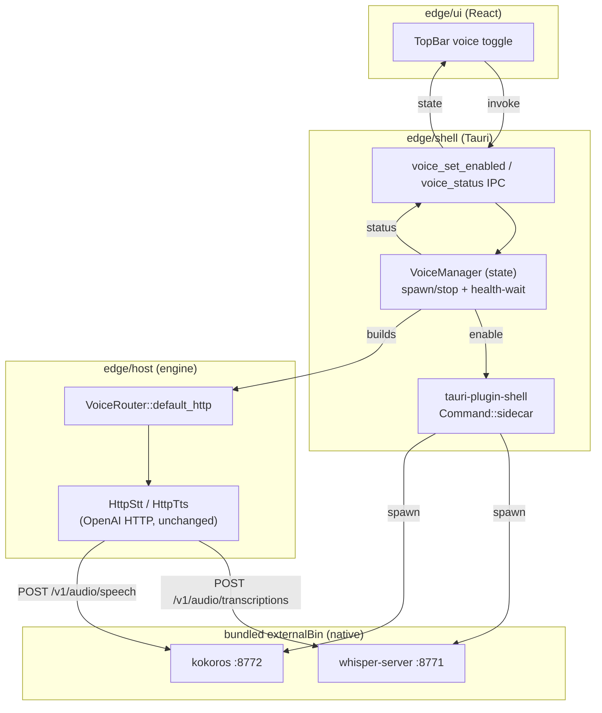

# Plan: Voice Native Bundle + One-Command Dev Stack

**Status:** draft
**Branch:** feat/voice-native-bundle
**Spec:** this file (no separate spec.md — small, well-scoped feature)
**Created:** 2026-06-17

## Overview

Make the edge desktop app a **self-contained deployable**: a user installs one
`.app` and voice works with no Docker, no Python, no manual setup. Today the
voice pillar is fully built and tested as a library but is **not wired into the
running app at all**, and the only way to run the speech engines is two Python
Docker containers an operator starts by hand.

This plan does three things: (A) gives developers **one command** that boots the
whole local stack (hub + voice + edge), (B) **wires voice into the app** with an
in-app on/off toggle, and (C) **swaps the Python Docker engines for native
binaries** (`whisper.cpp` for STT, `Kokoros` for TTS) that the app bundles and
manages itself. The OpenAI-compatible HTTP contract is preserved, so the
existing `HttpStt`/`HttpTts` adapters barely change.

## Why native binaries (not the Python Docker servers)

`faster-whisper-server` (CTranslate2) and `Kokoro-FastAPI` (PyTorch + espeak-ng)
cannot be bundled into a desktop app reliably — freezing PyTorch with PyInstaller
is fragile, multi-GB, and breaks per-platform. `whisper.cpp` and `Kokoros` are
single native binaries that expose the **same** OpenAI-compatible endpoints
(`POST /v1/audio/transcriptions`, `POST /v1/audio/speech`), so they drop in
behind the existing adapters and bundle cleanly via Tauri `externalBin`. This
also removes Docker from the voice path entirely — the same binaries serve the
dev stack and the shipped app.

## Constitution check

Articles (`docs/spec/constitution.md`):

- I Test-First → pass (RED test before each GREEN task; UI toggle via `?mock` seam)
- II Evidence-Driven → pass (engine choices verified against live endpoints, see research notes in this file)
- III Hard-Fail CRITICAL → pass (sidecar spawn failure surfaces a typed error + UI state; never a panic)
- IV Independent Stories → pass (lanes A/B/C independently testable; D integrates)
- V Simplicity Gate → **watch** (adds `tauri-plugin-shell` + 2 bundled binaries; justified — no other way to manage/bundle sidecars. No new abstraction layers.)
- VI Edge-Autonomy → pass (engines are local native binaries on 127.0.0.1; no cloud)
- VII One-Directional Dependency → pass (shell→host→voice; voice never depends up)
- VIII Event-Sourced Truth → n/a (no event store touched)
- IX Privacy Boundary → pass (audio + text stay local; only hit loopback sidecars)
- X Schema-Validated Payloads → pass (STT JSON parsed against known shape; voice IPC args typed)

## Technical context

- **Engines:** STT `whisper.cpp` (`whisper-server`, `--inference-path /v1/audio/transcriptions`, GGML `tiny.en` ≈ 75 MB). TTS `Kokoros` (Rust, OpenAI `/v1/audio/speech`, ONNX model + voices). Fallback if `Kokoros` packaging is painful: `sherpa-onnx` (does both STT+TTS) — decide in Step 1, record here.
- **Ports:** STT 8771, TTS 8772 (unchanged — `HttpStt`/`HttpTts` already target these).
- **Crates touched:** `wagner-edge-shell` (IPC + lifecycle + bundle), `wagner-edge-host` (VoiceManager state, small router tweak). UI `edge/ui/app`.
- **New dep:** `tauri-plugin-shell` (sidecar spawn + target-triple resolution).
- **Bundling:** Tauri `bundle.externalBin` (target-triple-suffixed binaries only — small). **Models are NOT bundled**: they download on first voice-enable into app-data, with an in-app voice-settings panel to trigger + monitor the download (operator decision).
- **Out of scope:** mic capture / audio playback (no audio I/O device wiring), streaming, wake-word, Windows/Linux binary acquisition (macOS arm64 first; structure leaves room).

## Visual



## Prerequisites

- Current `feat/voice-sidecars` work (HttpStt/HttpTts + tests) merged or rebased in.
- `make verify` green at start.

## Steps

### Step 1: Choose + verify the native engines

**What:** Acquire `whisper-server` (whisper.cpp) and the TTS binary (`Kokoros`,
or `sherpa-onnx` fallback) for macOS arm64. Run each by hand on 8771/8772 with a
chosen model and prove the OpenAI endpoints respond. Record the final TTS choice
+ exact binary source + model files in this plan's "Decisions" section.

**Tests:** manual curl round-trip (TTS synth → STT transcribe), same as proven
with the Docker engines. Capture the working invocation flags.

**Acceptance:**
- [ ] `whisper-server` returns `{"text":...}` for a real WAV on :8771
- [ ] TTS binary returns audio bytes on :8772 for `/v1/audio/speech`
- [ ] Exact binary origin + model files + launch flags recorded below

### Step 2: Native launcher; retire the Docker launcher

**What:** Rewrite `scripts/voice-sidecars.sh` to spawn the **native binaries**
(resolved from a known dev path) instead of `docker run`. Delete all Docker
specifics. Keep `start|stop|status` + the readiness probe. Update `make
voice-up`/`voice-down` (now native). Remove Docker mentions from
`docs/development.md`.

**Tests:** `make voice-up && make voice-e2e` green against native binaries;
manual round-trip green.

**Acceptance:**
- [ ] `scripts/voice-sidecars.sh` spawns native binaries, no Docker
- [ ] `make voice-e2e` passes against native sidecars
- [ ] No Docker references remain in voice docs

### Step 3: One-command dev stack

**What:** Add `make run` (alias `make up`) that boots **hub + voice + edge**
together (hub via `deno task dev`, voice via the native launcher, then the edge
app), and a `make down` that tears voice + hub down cleanly. Document it.

**Tests:** `make run` brings all three up; health checks pass (hub `/health`,
voice `/health` ×2, app window or `?mock` reachable); `make down` stops them.

**Acceptance:**
- [ ] `make run` starts hub + voice + edge with one command
- [ ] `make down` cleanly stops the spawned services
- [ ] Documented in `docs/development.md` Makefile reference

### Step 4: Voice engine state + IPC commands (RED→GREEN)

**What:** Add a `VoiceManager` (in `wagner-edge-host`, Tauri-free) holding voice
enabled-state + the `VoiceRouter`. Add `#[tauri::command]`s in
`edge/shell/src/commands.rs`: `voice_status() -> { enabled, ready }` and
`voice_set_enabled(on: bool)`. Register both in `generate_handler!`. Manage the
`VoiceManager` in `.setup`.

**Tests:** host unit tests for `VoiceManager` state transitions (RED first);
shell command tests for status/set_enabled wiring.

**Acceptance:**
- [ ] `voice_status` / `voice_set_enabled` registered + return typed results
- [ ] `VoiceManager` state transitions unit-tested
- [ ] `make verify` green

### Step 5: App-managed sidecar lifecycle

**What:** Add `tauri-plugin-shell`. In `VoiceManager`/command layer, `enable`
spawns the two sidecars via `Command::sidecar(...)` (target-triple-resolved),
waits for `/health`, flips `ready`; `disable` kills them. Spawn failure →
typed error + `enabled=false`, surfaced to the UI (Article III). Idempotent.

**Tests:** lifecycle test — enable spawns + becomes ready, disable stops;
failure path (bad binary) yields error not panic. (Gated behind a flag so CI
without binaries skips, like `#[ignore]` voice-e2e.)

**Acceptance:**
- [ ] Toggling enable starts + health-waits both sidecars; disable stops them
- [ ] Spawn failure is a typed error, never a panic
- [ ] Re-enabling when already up is a no-op (idempotent)

### Step 6: In-app voice toggle (UI)

**What:** Add a voice on/off control to `edge/ui/app/components/TopBar.tsx`,
wired through `edge/ui/transport/ipc.ts` (extend the command allowlist with
`voice_status`/`voice_set_enabled`). Reflect `enabled`/`ready` (off / starting /
on / error). Drive it in the headless `?mock` journey.

**Tests:** UI journey (`make edge-ui`) toggles voice and asserts state text;
ipc.ts mapping unit test.

**Acceptance:**
- [ ] TopBar shows a voice toggle reflecting real state
- [ ] Toggle invokes the IPC commands via the allowlisted mapping
- [ ] `make edge-ui` journey covers the toggle; `make accept` green

### Step 7: Model download manager + voice-settings panel

**What:** Models download on first enable (not bundled). Add a download manager
(host/shell) that fetches the STT + TTS model files into app-data, emits
progress events, and resolves their paths for sidecar launch. Add a **voice
settings panel** in the UI to trigger the download, show per-model progress
(downloading / verifying / ready / failed), and re-download. Voice-enable is
blocked (with a clear prompt) until models are present.

**Tests:** download manager unit tests (progress events, resume/overwrite,
checksum/verify, failure → typed error); UI test for the settings panel
progress states via the `?mock` seam (mocked progress events).

**Acceptance:**
- [ ] First enable with no models prompts → settings panel downloads them
- [ ] Progress is visible + monitored per model; failure is recoverable
- [ ] Models cached in app-data; subsequent enables skip download
- [ ] Download failure is a typed error, never a panic (Article III)

### Step 8: Tauri externalBin bundling (binaries only)

**What:** Declare the two **binaries** in `tauri.conf.json` `bundle.externalBin`
(target-triple naming, e.g. `binaries/whisper-server`, `binaries/kokoros`). Add
the build wiring so `cargo tauri build` (or `make edge-bundle`) produces a `.app`
containing them. Models are fetched at runtime (Step 7), not bundled. Resolve
binary paths via the shell plugin sidecar API.

**Tests:** build the bundle; on a clean path (no dev binaries, Docker stopped),
launch the built `.app`, download models via the settings panel, then confirm a
TTS→STT round-trip from bundled binaries + downloaded models only.

**Acceptance:**
- [ ] `.app` bundle contains both native binaries (no models)
- [ ] Freshly built app: download models in-app → voice round-trip works
- [ ] Bundle size recorded (binaries only — small)

### Step 9: E2E, docs, cleanup

**What:** Update `docs/development.md` (native voice section, `make run`) and
`build-context.md` (remove "stand up sidecars" as an open item; record the
native bundle). Confirm `make verify` + `make accept` green. Remove any stale
Docker references.

**Acceptance:**
- [ ] Docs reflect native voice + one-command stack
- [ ] `build-context.md` updated; Docker voice path fully retired
- [ ] `make verify` + `make accept` green

## Decisions (verified in Step 1 — two native spikes)

- **STT = whisper.cpp `whisper-server`** (Homebrew `whisper-cpp` 1.8.7; for the
  bundle we ship the binary). Flags: `--host 127.0.0.1 --port 8771
  --inference-path /v1/audio/transcriptions --model ggml-tiny.en.bin --threads 4`.
  Model `ggml-tiny.en.bin` 74 MB (HF `ggerganov/whisper.cpp`). **No HttpStt change.**
- **TTS = our own in-repo Rust sidecar crate** (not a third-party binary). Stack:
  `misaki-rs` (pure-Rust MIT G2P, `default-features = false` → no espeak/GPL) →
  `ort` (ONNX Runtime, MIT) running the **Kokoro-82M** ONNX model → WAV → a tiny
  HTTP server (`tiny_http`) on `127.0.0.1:8772` exposing `POST /v1/audio/speech`.
  Model: `kokoro-v1.0.onnx` (q8 ≈ 92 MB or fp16 ≈ 163 MB) + `voices-v1.0.bin`
  (~27 MB) from `onnx-community/Kokoro-82M-v1.0-ONNX` / `thewh1teagle/kokoro-onnx`
  (Apache-2.0 weights). Compiles as a workspace crate → bundles as `externalBin`,
  no fork to maintain, no Python, no GPL.
- **Why not Kokoros/koko or sherpa-onnx:** both pull in **espeak-ng (GPLv3)** via
  their phonemizer — a real risk even for an internal tool. Replacing the
  phonemizer (misaki-rs), not the model, removes it. Deep TTS survey (Step 1)
  confirmed nothing clean-permissive beats Kokoro on quality.
- **HttpTts adapter:** our sidecar returns WAV directly → likely no change needed
  (confirm Content-Type handling). `voice: "af_bella"` maps via misaki/voices.bin.
- **OOV tradeoff:** words outside misaki's lexicon spell letter-by-letter;
  acceptable, fixable later with a small custom lexicon.
- **Total first-enable model download ≈ 165–240 MB** (whisper tiny.en 74 MB +
  Kokoro q8/fp16 ~92–163 MB). Confirms download-on-first-enable (Step 7).
- **Attribution:** ship a LICENSES/NOTICE record (MIT whisper.cpp + ggml; MIT
  misaki-rs + ort; Apache-2.0 Kokoro weights).

## Risks & open questions

- **Prebuilt vs build-from-source binaries.** `whisper.cpp` ships macOS release
  binaries (and Homebrew); `Kokoros` may need `cargo build --release`. If
  building, the bundle step must produce/ship the artifact. Decide in Step 1.
- **Model download UX (decided: download, not bundle).** Models fetch on first
  enable into app-data with an in-app settings panel showing progress (Step 7).
  Trade-off accepted: needs network once + a download UX; keeps the `.app`
  small. Risks: download interruption (must be resumable/retryable), source URL
  stability + checksum verification, and voice being unusable until the first
  download completes (handled by gating enable behind a clear prompt).
- **Port collisions.** If 8771/8772 are taken, spawn fails — surface clearly;
  dynamic ports are a future option (the adapters take a base URL already).
- **macOS code-signing** of bundled binaries (Gatekeeper) — out of scope here,
  flagged for the distribution story.
- **Cross-platform.** macOS arm64 first; `externalBin` target-triple naming
  leaves room for Windows/Linux without restructuring.

## Verification (whole plan)

- `make verify` + `make accept` green.
- `make run` boots hub + voice + edge in one command; `make down` stops it.
- In-app toggle starts/stops voice; status reflects reality.
- A freshly built `.app`, launched with Docker stopped and no dev binaries on
  PATH, performs a TTS→STT round-trip — proving the deployable is self-contained.
```
