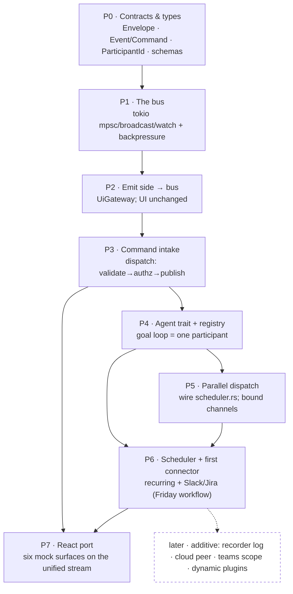

# Plan — 011 · runtime foundation (the event bus & participants)

> Implements `docs/runtime-architecture.md`. Migrates the **existing** app onto the
> event-bus spine **without ever leaving it broken**: every step keeps `make verify`
> + `make accept` green (strangler-fig, not big-bang).

## Overview

Today Wagner emits ~7 ad-hoc events to the UI and runs a goal loop that sits at the
center and dispatches subtasks one-at-a-time. This plan turns that into a single
typed **event bus** where agents, connectors, the scheduler, and the UI are
interchangeable **participants** — so new agents and integrations plug in the same
way, dozens run at once without blocking the UI, and the goal loop becomes just one
participant. We do it as swap-in-place steps on the running app, not a rewrite.

## Visual — phases & dependencies

## Prerequisites

- `docs/runtime-architecture.md` (the design) — LOCKED.
- Green baseline: `make verify` + `make accept` pass before starting.
- Constitution Articles VII (one-directional deps), IX (privacy), X (schema-validated
  payloads) continue to hold throughout.

## Steps

### Step 0 — Contracts & types (no behavior)
**Why:** everything below depends on these; lock the public contract first so we never
churn it mid-build.
**Implement:**
- `Envelope`, `EventId`, `StreamId`, `ParticipantId` (+ `ParticipantKind`), `Scope`,
  the core `Event` enum (namespaced: `Run`, `Goal`, `Vault`, `Voice`, `Ui` — derived
  from today's 7 channels), the `Command` enum, the `Ext { ns, name, version, payload }`
  variants, and a `Stability` annotation. All `#[derive(Serialize, Deserialize)]`.
- Export JSON Schemas to `edge/host/schemas/` (Article X) per payload.
**Tests:** serde round-trip per variant; schema accept/reject; a guard that no
`Event`/`Command` carries a non-serializable handle (the §7 seam).
**Acceptance:** [x] types compile [x] schemas generated [x] round-trip + schema tests
pass [x] `make verify` green (nothing wired yet). **✅ DONE — delivered by `specs/013`
(commit `1dc9bfd`); 14 contract tests + TS bindings.**

### Step 1 — The in-process bus
**Why:** the spine. Build and test it standalone before anything depends on its behavior.
**Implement:** a `Bus` interface over tokio — bounded `mpsc` (commands), `broadcast`
(fan-out), `watch` (latest-state); `publish(Envelope)` + `subscribe(Subscription)`;
per-stream `seq`; explicit `Lagged`/overflow handling.
**Tests:** publish→subscribe delivery; per-stream ordering; slow-subscriber `Lagged`
path; bounded-queue overflow behavior; many concurrent publishers/subscribers.
**Acceptance:** [x] bus unit tests pass [x] not yet wired → `make verify` green.
**✅ DONE — `edge/host/src/bus/runtime.rs` (`Bus`/`Subscriber`/`RecvError`); 6 tests:
publish→subscribe delivery, per-stream seq (monotonic + independent), namespace +
stream filtering, slow-subscriber Lagged + recovery, many concurrent pub/sub. Built
standalone, not wired (P2 routes the emit side through it).**

### Step 2 — Route the emit side through the bus (UI unchanged)
**Why:** prove the bus carries real traffic with zero UI risk. The React tree + the
`shared/` reducer don't change at all — the lowest-risk way to start the migration.
**Implement:** a `UiGateway` participant that subscribes and re-emits the existing
`wagner://*` Tauri events. Convert the ~7 `app.emit(...)` call sites in
`edge/shell/src/commands.rs` to `bus.publish(Event::…)`.
**Tests:** golden test — bus→UiGateway→Tauri payload matches the old schema for each
of the 7; the `?mock` reducer journey stays byte-compatible.
**Acceptance:** [x] `make accept` green (UI journey unchanged) [x] all UI events now
originate from `bus.publish`. **Rollback:** revert the call-site swaps; `UiGateway` is additive.
**✅ DONE — `edge/shell/src/bus_gateway.rs` (`UiGateway` + pure `project()` seam); 6 byte-compat
golden tests cover all 7 channels. All 9 emit sites in `commands.rs`/`gate.rs` now `publish` typed
events; the gateway task re-emits `wagner://*` identically. Leaf variants added to `RunEvent`
(Snapshot/Activity/Transmission/WorkflowStep/WorkflowDone), `UiEvent::Panel`,
`VoiceEvent::DownloadProgress` (schema-opaque during migration; P7 tightens). `make verify` +
`make accept` green; abort still terminal.**

### Step 3 — Command intake (the one path in)
**Why:** collapse ~26 ad-hoc Tauri handlers into one validated, authorized path — the
security + future-tenancy chokepoint, and the "say it / click it / schedule it" unifier.
**Implement:** `dispatch(Command) -> Result<Accepted>`: validate (schema) → authorize
(route through the existing MCP permission gate / Article IX) → stamp `Envelope` →
`bus.publish`. Migrate action commands (`start_run`, `abort`, `steer`, `add_goal`,
workflow ops) through dispatch; keep pure reads (`get_initial_state`, `vault_graph`) direct.
**Tests:** each migrated command yields the right bus event(s); authz-deny path;
schema-invalid command rejected; **abort still terminates the run** (reuse the B3
`aborted_marks_run_terminal` test).
**Acceptance:** [x] `make verify` + `make accept` green [x] actions flow command→intake→bus.
**✅ DONE — `edge/host/src/bus/dispatch.rs` + `Bus::dispatch`/`dispatch_json`/`take_commands`
(bounded mpsc intake): validate (schema, JSON boundary) → authorize (`CommandAuthorizer`
Article IX seam, v1 `AllowAll`) → stamp → enqueue. 5 tests (accept, deny, schema-invalid,
json, backpressure). `abort` routed through `dispatch` (effect stays inline until P4 inverts
it); gateway drains the intake (P4 replaces with the registry). Command leaves added:
`RunCommand::{Abort,Steer}`.**

### Step 4 — Agent trait + registry; goal loop becomes one participant
**Why:** the pluggability contract every future agent/connector uses — and the inversion
(goal loop = participant, not center).
**Implement:** `Agent` trait + `AgentContext` + `AgentRegistry`. Wrap the existing goal
loop (`edge/host/src/orchestrator/run_loop.rs`) as one `Agent` that subscribes to
goal/command events and publishes facts; `AgentPool` stays as that participant's fan-out;
fold `RunManager` into the registry of running participants.
**Tests:** goal-loop-as-agent drives a goal to completion with the deterministic fake
`AgentPool`; registry spawn/supervise/stop; abort via command still works.
**Acceptance:** [x] existing goal-loop tests pass through the trait [x] `make verify` green.
**✅ DONE — `bus::AgentContext` (identity-stamped publish + dispatch) + `bus::AgentRegistry`
(spawn/supervise/stop, multi-subscription routing via `subscribe_many`); 5 registry tests.
`orchestrator::GoalLoopAgent` wraps `run_goal`, translating its emit/progress/panel callbacks
into bus facts; a test drives a goal to **Met** with the deterministic fake `AgentPool` and
asserts a terminal `Snapshot` fact (stamped with the goal-loop identity) reaches the bus.
Abort-via-command works through P3's `dispatch`. Remaining integration (the shell adopting the
registry to spawn the loop + folding `RunManager`) is additive — the registry it folds into now
exists. `make verify` + `make accept` green.**

### Step 5 — Parallel dispatch + backpressure ("30 at once")
**Why:** the concurrency the platform needs — using logic that already exists but is
unwired (`scheduler.rs` is dead code today).
**Implement:** replace the sequential `for` loop in `run_loop.rs` (~L260–293) with
bounded `FuturesUnordered`/`join_all` gated by `orchestrator/scheduler.rs` (its MIN/MAX
cap + worktree isolation). Bound the stdout channel in `cli/driver.rs` (`mpsc::channel(4096)`).
**Tests:** a goal with N independent subtasks runs them concurrently (assert overlap),
capped at the limit; high-output subprocess applies backpressure, doesn't OOM; UI stays
responsive.
**Acceptance:** [x] concurrency + backpressure tests pass [x] `make verify` green.
**✅ DONE — `scheduler::non_overlapping_waves` (overlapping writers serialized into sequential
waves; disjoint + read-only run together) + `scheduler::run_bounded` (concurrent, capped via
`default_concurrency`). `run_goal`'s sequential subtask loop replaced with wave-by-wave bounded
dispatch (deterministic plan-order fold preserved → goal-loop tests unchanged). `cli/driver.rs`
stdout channel: unbounded → bounded(4096) `send().await` → backpressure, bounded memory. Tests:
overlap-serialization, capped-concurrency-with-overlap (deterministic, explicit cap). Full
worktree isolation of overlapping writers is the additive upgrade.**

### Step 6 — Scheduler participant + first connector
**Why:** proves "new agent = new integration = same move," and unblocks Workflows (the
mock's Friday Jira→Slack).
**Implement:** a `Scheduler` agent emitting `tick`/trigger events (time + event triggers);
the **first connector** (Slack *or* Jira) as an `Agent` — subscribes to intents, calls the
external API, publishes facts, owns its own retry/queue.
**Tests:** scheduler fires a command on a fake clock; connector handles an intent +
publishes a fact; connector failure retries without blocking the bus.
**Acceptance:** [x] a scheduled command triggers a connector action end-to-end (fakes)
[x] `make verify` green.
**✅ DONE — `participants::SchedulerAgent` (fires queued commands when `now >= fire_at` via the
P3 intake; deterministic under an injected clock; once-only) + `participants::SlackConnector`
(an `Agent` subscribing to `ext.slack` `send` intents; calls an injectable `SlackTransport` with
bounded retry; publishes an `ext.slack` `message_sent` fact). 3 tests: fake-clock firing,
retry-then-publish, exhausted-retries-error-without-blocking-the-bus. ponytail: immediate retry
(backoff + dead-letter when a real workspace needs it); recurring schedules re-queue (v2).**

### Step 7 — React port onto the unified stream
**Why:** ship the UI you designed, on the real foundation.
**Implement:** point `edge/ui` at the unified event stream + `dispatch`; the `shared/`
reducer folds the typed `Event`s; UI actions call `dispatch(Command)`; port the six
locked mock surfaces; implement snapshot hydration + resync-on-gap.
**Tests:** the `?mock` journey drives the new typed events; per-surface render tests;
gap → resync from `get_initial_state`/`get_run_state`.
**Acceptance:** [ ] `make accept` green on the new stream [ ] the six surfaces render
from real events.

## Verification (whole plan done)

- `make verify` + `make accept` green at every step and at the end.
- All UI events originate from `bus.publish`; all actions flow through `dispatch`.
- A goal runs N subtasks concurrently (capped); a scheduled trigger drives a connector
  end-to-end; the goal loop is registered as one participant among others.
- The §7 seams hold: events are serializable, the envelope carries origin + scope, the
  bus is behind its interface.

## Out of scope (later, additive — architecture §6/§7)

Recorder/event-log participant · cloud-peer hardening · teams/workspace scope enforcement ·
dynamic (load-time) plugin discovery. None require touching the core built here.

## Next

- `/tdd` Step 0, or `/execute-plan` to run the phases in order.
