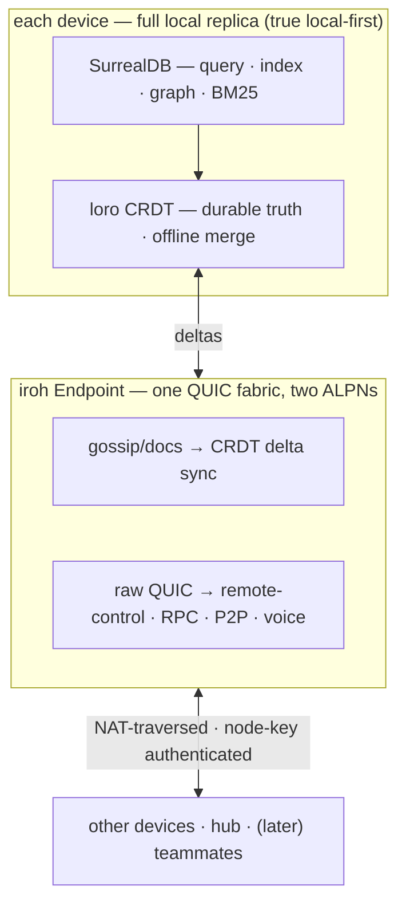
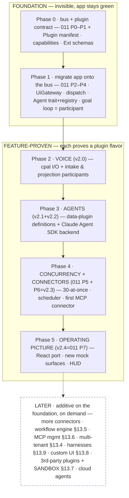

# design — 012 · platform foundation & foundation-first buildout

> Brainstorm output (2026-06-18). Settles the open foundation primitives the new
> vision implies (`VISION.md`, `docs/wagner-vision-and-architecture.md` §12–13)
> and orders the whole buildout **foundation-first**. Companion to
> `docs/runtime-architecture.md` (LOCKED) and `specs/011-runtime-foundation/plan.md`
> (the event-bus migration this builds on).

## Problem

The vision widened Wagner from an engineering platform into a local-first
**personal OS**: agents, deterministic + agentic workflows, knowledge, search,
connectors, voice, and dedicated workspaces (vision §12), plus a nine-item
product-shaping backlog (§13). That is a large surface. Built ad-hoc on today's
~7 `app.emit` channels and the center-of-the-world goal loop, each subsystem
becomes a bespoke integration and the second one rewrites the first. We need
(a) the foundational primitives settled correctly and (b) a dependency-correct
build order — not hacks.

## Approach — Shape B: foundation, then feature-proven

Build the one thing everything rides (the typed event bus), then let the **first
real feature** force each remaining decision — each proven by use, not
speculation. Strangler-fig: every step keeps `make verify` + `make accept` green.

Rejected **Shape A** (decide + build every primitive up front): it commits to the
two hardest reversibles (knowledge backend, plugin runtime) *before any feature
stresses them* — exactly when you guess wrong and rebuild — and keeps v1 broken
through a long invisible stretch.

## Settled foundation primitives

| Primitive | Decision |
|---|---|
| **Build shape** | B — foundation, then feature-proven; strangler-fig (app stays green) |
| **Event bus** (`011`) | bus-first; typed `Envelope` + `Event`/`Command` taxonomy + `Agent` trait + one `dispatch` intake. Everything rides it. |
| **Data layer** | loro merges · iroh moves bytes (gossip *and* direct QUIC) · SurrealDB answers questions |
| **Extension model** | one uniform Plugin manifest (`Agent` + capabilities + schemas); compile-time now / load-time later; sandbox deferred, capability seam declared now |

### Data layer — loro merges · iroh moves bytes · SurrealDB answers questions

**Verified 2026-06-18** (Perplexity, citing surrealdb.com/docs, the 3.0
announcement, the scalability blog, and GH discussion #107): **SurrealDB ships no
CRDTs.** Its distributed consistency is **Raft via TiKV** (centralized, strongly
consistent); its "local-first" means *embedded single-node*, not multi-device
merge; CRDTs appear once, as a 2023 research discussion, never shipped.

Therefore true local-first *requires* a real CRDT engine — and **loro**, already
shipped, is best-in-class (Rust/Fugue, faster and more compact than Yjs /
Automerge). You cannot replace loro with SurrealDB; SurrealDB has nothing to
replace it with.

- **loro** = durable truth + offline multi-writer conflict-free merge.
- **iroh** = one QUIC `Endpoint`, two ALPNs: gossip/docs for CRDT deltas **and**
  raw QUIC streams for secure remote reach to the laptop, low-latency P2P, and
  voice streaming. *(The raw-QUIC use is the one new thing — additive.)*
- **SurrealDB** = local query / index / graph / BM25 over loro-converged state.

This is `runtime-architecture.md` §0.3 unchanged; the only addition is the direct
iroh-QUIC ALPN. Rejected "replace transport with SurrealDB" — impossible (no
CRDTs), and TiKV/Raft is server-centric, fighting the local-first tenets.

### Extension model — one uniform Plugin manifest

Everything that lives on the bus is an `Agent` participant ("a connector is *the
same trait*" — `runtime-architecture.md` §3). Elevate that to **the** plugin
foundation: one **Plugin manifest** declaring `{ participants provided, event/
command namespaces + registered schemas, config, capabilities requested,
stability tier }`. One registration path (compile-time `inventory` today,
load-time later — *same manifest*). Four flavors, identical contract:

- **Rust code plugin** (connector, watcher) — a direct `Agent` impl.
- **Data definition** (agent / workflow) — a generic participant parameterized by data.
- **MCP connector** — a generic MCP-client participant + server config. *(MCP is the connector plugin model; we don't reinvent it.)*
- **Harness** (Cursor / OpenCode) — external CLI + a first-party event mapper behind `AgentPool`.

Third-party **code** plugins (§13.7) + the sandbox/registry are **deferred**
(someday goal; the operator authors all plugins near-term). The forward-compat
seam that keeps them additive instead of a rewrite: **declare capabilities now,
enforce later** — a plugin states "I need network / vault-write / spawn-process";
today honored on trust, the someday-sandbox is an enforcement ring over that same
declaration. Satisfies "correct, not bespoke" without building the expensive
runtime now.

## Buildout sequence

Phases 0–1 build the foundation by carrying the *existing* app onto it (stays
green). Every later phase is a new subsystem that **proves one flavor of the
plugin contract**, not a speculative build.

| Phase | What | = roadmap | Proves |
|---|---|---|---|
| **0** | bus + types + **Plugin manifest + capabilities** + schemas | `011` P0–P1 (+manifest) | foundation exists |
| **1** | migrate app onto bus: UiGateway · dispatch · `Agent` trait+registry · goal loop = participant | `011` P2–P4 | foundation carries the *real* app, green |
| **2** | **Voice** — cpal I/O + intake & projection participants | v2.0 | first new participant + visible v1 win |
| **3** | **Agents** — data-plugin definitions + Agent SDK backend | v2.1+v2.2 | data-plugin flavor + backend seam |
| **4** | **Concurrency + connectors** — 30-at-once · scheduler · first MCP connector | `011` P5 + P6/v2.3 | MCP-connector flavor + workflows |
| **5** | **Operating picture** — React port · new mock surfaces · HUD | v2.4 / `011` P7 | product surface on real events |
| later | connectors · workflows · MCP mgmt · multi-tenant · harnesses · custom UI · 3rd-party + sandbox · cloud | §13 | additive — foundation already holds |

### Frontend last (Phase 5), deliberately

The redesigned React port is last so the UI — the most expensive thing to
rebuild — is built **once**, on a frozen taxonomy. Safe because:
1. Phase 1's `UiGateway` keeps the *existing* UI running on the bus through
   Phases 2–4 (never blind; drive with current UI + voice + the `?mock` journey + logs).
2. Phase 0's taxonomy is designed **against the new mock surfaces** (the UI is being
   gutted + re-mocked now, 2026-06-18) — so the port is a *pure consumer*, not a
   foundation-reopener. Keep the mocks ahead of the Phase 0 taxonomy freeze; and
   since the taxonomy is **additive-versioned** (`runtime-architecture.md` §2), a
   late surface need is *add a field*, not rework. Lock the design early (in
   progress), build the UI late.

## Amendments this implies (do during build, not now)

1. **`specs/011` P0/P4** — add the **Plugin manifest + capability declaration**.
   `011` has the `Agent` trait but not the uniform manifest/capabilities. The one
   real addition to the locked plan.
2. **`docs/runtime-architecture.md`** — add the **voice-projection participant**
   (symmetric to voice-as-command-source, §2) + the **direct iroh-QUIC ALPN**
   (§1/§5). Both additive, consistent with the LOCKED tenets.
3. **Data layer** — no change; document the iroh-QUIC-direct use.

## Trade-offs accepted

- **Phases 0–1 are invisible** (bus migration) before the first visible win
  (voice, Phase 2). Accepted: the app stays green and usable on the existing UI
  throughout.
- **Offline-on-every-device** (loro) over the simpler authoritative-node model.
  Accepted: operator wants true local-first; loro already carries the cost.
- **No third-party plugin runtime yet.** Accepted: YAGNI for a solo author; the
  capability seam keeps it additive.
- **Direct iroh-QUIC remote access** widens the attack surface vs gossip-only.
  Mitigate at build: node-key auth + the Article IX privacy boundary + the
  command-intake authorize step.

## Open questions (carry into the build)

- Concrete first cut of the core `Event`/`Command` enums (Phase 0 — from the 7
  channels + voice + the first connector).
- Agent SDK: TypeScript or Python, and where it runs vs the Tauri-free host
  (mirror the voice-sidecar lifecycle?) — vision §12 open Q.
- First connector: Slack or Jira (the Friday workflow eventually wants both).
- Capability vocabulary v1 — the minimal set worth declaring now.
- Voice-projection policy: which facts get *spoken* vs only shown (needs a rule —
  not everything).

## Next

`/write-plan` to fold Phases 0–1 into the amended `011` task list, or
`/execute-plan` straight into `011` P0 (types + manifest). Frontend (Phase 5)
waits.
