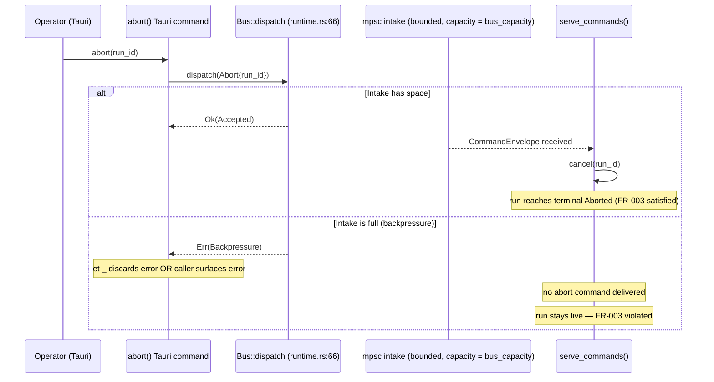
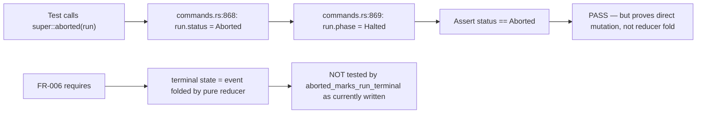

# Spec Challenge Report: Registry Run Supervision (014)

**Reviewer:** spec-challenger agent
**Generated:** 2026-06-19
**Spec version:** 2a4b4733a79ec36f6015218e90a76a600e0373c6 (branch `013-event-bus-contracts`)
**Constitution:** `docs/spec/constitution.md` v0.1.0

> This report is adversarial by design. Findings without evidence are themselves CRITICAL.
> Engineer disposition is recorded per finding; rejected findings require rationale.

---

## Summary

| Severity | Count | Open | Resolved | Rejected (with rationale) |
|----------|-------|------|----------|---------------------------|
| CRITICAL | 3 | 0 | 3 | 0 |
| HIGH | 3 | 0 | 3 | 0 |
| MEDIUM | 1 | 0 | 1 | 0 |
| LOW | 0 | 0 | 0 | 0 |

**Verdict:** Original — BLOCKED (3 CRITICALs). **After dispositions (2026-06-19):** all 7 findings ACCEPTED and resolved by spec/plan/tasks edits (pre-commit, this session). Zero open CRITICAL/HIGH. Re-run `/spec validate` to confirm READY.

---

## Findings

| ID | Severity | Category | Location | Evidence | Recommendation | Engineer disposition |
|----|----------|----------|----------|----------|-----------------|----------------------|
| C1 | CRITICAL | Constitution-violation (Article VIII) | plan.md:45 vs. constitution.md:132 vs. tasks.md (all tasks) | plan.md:45 reads "the carried log-replay-equals-snapshot discipline holds." constitution.md:132 (Gate VIII pass criteria) reads "a test replays a run's event log from empty and asserts the projection equals the live snapshot." Grep of every `.rs` test file in `edge/host/tests/` and `edge/host/src/` finds zero functions matching `log_replay`, `replay.*log`, or `replay.*snapshot`. T005 (`run_cancel.rs`) tests terminal `Aborted` *emission* only — that is not a log-replay-equals-snapshot test. plan.md asserts the gate "holds" via a carried discipline that does not exist in this codebase for the aborted/halted terminal state. The Complexity Tracking table in plan.md:151 is empty ("no entries"), meaning no deviation from Gate VIII is recorded. | Add a log-replay-equals-snapshot test for the `Aborted` terminal state: given an aborted run's append-only event log replayed through the pure reducer from empty, the resulting snapshot equals the live snapshot. This test must exist before plan.md:45's self-certification is valid. | ACCEPTED — see Dispositions below |
| C2 | CRITICAL | Contradiction (FR-003 vs. plan §Failure Modes + dispatch backpressure) | spec.md:71, plan.md:140, edge/host/src/bus/runtime.rs:68 | spec.md:71 reads "Aborting a run MUST terminate that run and transition it to a terminal Aborted state." plan.md:140 reads "Risk: if the intake ever backpressured, abort could delay." runtime.rs:68 reads `Err(mpsc::error::TrySendError::Full(_)) => Err(DispatchError::Backpressure)` — `dispatch` uses `try_send` and returns immediately if the intake is full. plan.md §Phase 1.2:121 confirms "abort/steer become dispatch-only Tauri commands." edge/shell/src/commands.rs:889 comment reads "Never block the abort itself on intake — a run must always be stoppable." The current code solves this by discarding the dispatch result (`let _`) and directly killing the task. The new design removes that direct kill path and routes abort exclusively through dispatch. If the intake is full when abort is dispatched, `DispatchError::Backpressure` is returned to the Tauri caller and no abort takes effect — directly contradicting FR-003's MUST. plan.md acknowledges this risk at line 140 but records no Complexity Tracking entry and proposes no concrete mitigation in the implementation design. | Either: (a) add a bounded priority lane for abort commands that cannot backpressure (requires Complexity Tracking entry), or (b) use `send` (blocking) instead of `try_send` for abort-class commands with a documented timeout, or (c) add a Complexity Tracking entry explicitly accepting the risk with a quantified probability bound and the concrete upgrade trigger. A future-refinement note at plan.md:140 without a Complexity Tracking entry does not satisfy Article VIII's requirement to justify gate deviations that the spec's own MUST-level requirement creates. | ACCEPTED — see Dispositions below |
| C3 | CRITICAL | Test-coverage gap (Article VIII violation in test design) | spec.md:26, tasks.md:39, edge/shell/src/commands.rs:867-871 + 1292-1300 | spec.md:26 (US1 Independent Test) reads "verified by the carried `aborted_marks_run_terminal` test passing through the new registry-routed path." tasks.md:39 (T009) reads "Re-point the carried `aborted_marks_run_terminal` test so it exercises the registry-routed abort path." The carried test lives at commands.rs:1292. It calls `super::aborted(run)` (commands.rs:1297), testing the shell function at commands.rs:867–871 which reads `run.status = RunStatus::Aborted; run.phase = RunPhase::Halted;` — a direct mutation of the run struct, not a reducer fold. FR-006 (spec.md:74) reads "the terminal state MUST be expressed as an event folded by the pure reducer — no run-state mutation outside the fold." The test being "re-pointed" currently validates the exact out-of-band mutation that FR-006 prohibits. "Re-pointing" means wiring the test to the new code path, not replacing what it asserts. The US1 Independent Test therefore rests on a test that currently verifies the anti-pattern, not the fold. There is no task that writes a new test asserting the terminal state results from a reducer fold over an event. constitution.md:132 Gate VIII: "the reducer has no I/O and is unit-tested in isolation; a test replays a run's event log from empty and asserts the projection equals the live snapshot." | Replace T009's "re-point" scope with a new assertion: after the registry-routed abort, the terminal `Run` must equal the projection produced by replaying the run's event log through the pure reducer from empty. This is distinct from asserting `status == Aborted` after calling `aborted()`. The current `aborted_marks_run_terminal` test must be deleted or modified to assert the fold, not the direct mutation. | ACCEPTED — see Dispositions below |
| H1 | HIGH | Contradiction (FR-001 text vs. plan §1.2 effect locality for `start`) | spec.md:69, spec.md:137, plan.md:121 | spec.md:69 reads "the system MUST route every run-control action (start, abort, steer) through the single validated command intake — validate → authorize → stamp — before **the action takes effect**, with no run-control action bypassing the intake." plan.md:121 reads "`start_run` dispatches `Start` (authz/audit) and, on `Accepted`, assembles Tauri deps and calls `registry.spawn_run` directly." The start command is dispatched and accepted, but `registry.spawn_run` — which is the call that makes the run live — is called directly in shell code, not routed through `serve_commands`. For `start`, the action that "takes effect" (the run becoming live) is `spawn_run`, and it bypasses `serve_commands` by design. spec.md:137 (Assumptions) acknowledges "start is therefore not a pure hub/bus command." The Assumption partially addresses this, but does not reconcile it with FR-001's "no run-control action bypassing the intake" language. US1-AS4 (spec.md:33) reads "it passes through the single validated command intake before it takes effect, with no bypass path" — no caveat for start. | Either: (a) tighten FR-001 language to read "every abort and steer" so it aligns with the actual design (start dispatches for authz but spawns directly), and update US1-AS4 to match; or (b) document the `start` exception in FR-001 with an explicit carve-out referencing the Assumption. As written, FR-001 and US1-AS4 are testably false for `start` under the spec's own design — a future engineer running against the Independent Test criteria could flag this as a bypass. | ACCEPTED — see Dispositions below |
| H2 | HIGH | Contradiction (FR-012 missing acceptance scenario) | spec.md:80, checklists/requirements.md:14 | spec.md:80 (FR-012) reads "The migration MUST preserve the existing operator-observable run behaviour: concurrent sessions, steering, blocked-timeout halt, and abort-leaves-running." No acceptance scenario in §US1 (AS1–AS8) covers migration behavioral equivalence — that is, "given the same operator actions that worked before, after the migration they still produce the same observable outcomes." AS1–AS8 test the new design's behaviors individually; none tests that previously-passing behaviors are preserved by the migration. SC-006 (spec.md:94) is a success criterion, not a Given/When/Then acceptance scenario. checklists/requirements.md:14 (CHK002) flags this as a GAP. The tasks.md Coverage Check (tasks.md:126) maps FR-012 to "T019 + SC-006 (make accept)" — SC-006 is verification method, not an acceptance scenario, and T019 is an implementation task, not a test. There is no test task in tasks.md that exercises FR-012's behavioral-equivalence claim. | Add one Given/When/Then acceptance scenario to US1 covering migration equivalence, and add a corresponding test task. Minimum: "Given a run that was in-progress before the migration, when the operator aborts it after the migration, the observable outcome (terminal Aborted, UI leaves running) is identical to the pre-migration behavior." | ACCEPTED — see Dispositions below |
| H3 | HIGH | Contradiction (AgentRegistry::spawn() replace-on-same-name behavior vs. FR-015) | spec.md:83, edge/host/src/bus/registry.rs:88-97, tasks.md:47 | spec.md:83 (FR-015) reads "A start/resume targeting a run_id that is already live MUST NOT terminate or restart the live run." registry.rs:88 (docstring) reads "spawning a name that is already live **replaces** the prior handle." registry.rs:94-97: `if let Some(prev) = self.running.lock()…remove(&name) { prev.abort(); }` — the existing `spawn()` method aborts and replaces any same-name entry. tasks.md:47 (T014) adds `spawn_run()` with a duplicate-name guard but does not remove or deprecate the existing `spawn()` method. Any call site that invokes `registry.spawn()` instead of `registry.spawn_run()` for a run will silently abort the live run, violating FR-015 with no compiler error. tasks.md T014 is the only guard, and it is an additive implementation task — it does not rename, deprecate, or restrict `spawn()`. There is no test that verifies `spawn()` cannot be called for a run-keyed participant (only that `spawn_run()` rejects duplicates). | Either: (a) rename the existing `spawn()` to `spawn_agent()` or mark it `#[deprecated]` so accidental use for runs is a compile-time signal, with a test that `spawn_run` is the only public path for run-keyed participants; or (b) add an explicit note in T014 that `spawn()` must be audited and all run-keyed callers migrated, with a test that no code in the repo calls `spawn()` with a `goal-loop:*` name. | ACCEPTED — see Dispositions below |
| M1 | MEDIUM | Edge-case-missing (failure category absent for abort flow) | spec.md §Edge Cases (lines 57-63) | The spec defines six edge cases: EC-001 (concurrency), EC-002 (boundary), EC-003 (failure/responsiveness), EC-004 (zero-state), EC-005 (concurrency), EC-006 (malicious). EC-003 is labeled "failure / responsiveness" but covers only the in-flight CLI subprocess scenario — it does not cover what happens when the abort dispatch itself fails (i.e., when `Bus::dispatch` returns `DispatchError::Backpressure` or `DispatchError::NoConsumer`). This is the failure category (what happens when the abort mechanism itself encounters an error) required for a state-mutation flow. The `DispatchError::Backpressure` case is acknowledged in plan.md:140 as a risk, confirming it is a real failure mode, but there is no edge case definition for what observable behavior results when abort dispatch fails. The edge case completeness check requires the failure category for every primary flow that mutates state (abort transitions a run to terminal state). | Add EC-007 (failure): "When an abort dispatch returns Backpressure or NoConsumer, the system logs the error and the operator receives an observable failure signal; the run is not left in an indeterminate state." Define the expected observable behavior and add a test for it. | ACCEPTED — see Dispositions below |

---

## Categories

A finding's category determines its expected severity floor:

| Category | Floor | Example |
|----------|-------|---------|
| Constitution-violation | CRITICAL | FR contradicts a project-constitution article without Complexity Tracking |
| Coverage-gap | CRITICAL | FR or SC has zero corresponding tasks |
| Independent-MVP-failure | CRITICAL | A P1 user story has empty or non-specific Independent Test |
| Test-coverage gap | CRITICAL | Implementation task exists without a preceding test task for the same behaviour |
| Contradiction | HIGH | Two parts of spec/plan/tasks state mutually exclusive things |
| Untestable-acceptance | HIGH | Acceptance scenario uses vague language without measurable threshold |
| Vague-adjective | HIGH | Spec uses fast, scalable, secure, robust without quantification |
| Speculative-feature | HIGH | Requirement not traceable to a user story |
| Cross-plugin-undefined | HIGH | Cross-Plugin Surfaces section omits an obligation for an affected plugin |
| Terminology-drift | MEDIUM | Same concept named differently across artifacts |
| Edge-case-missing | MEDIUM | Edge case category (zero-state, boundary, concurrency, malicious) absent for a flow with state mutation |
| Style / wording | LOW | Improvement to clarity that does not affect implementation correctness |

---

## Pass Coverage

| Pass | Findings | Notes |
|------|----------|-------|
| Pass 1 — Vague-adjective scan | 0 | Scanned spec.md FRs, SCs, Edge Cases, and acceptance scenarios for: fast, slow, scalable, robust, secure, intuitive, simple, lightweight, modern, efficient, seamless, clean, elegant, friendly, reasonable, appropriate, promptly. Zero instances without adjacent quantification. "promptly" in EC-003 was replaced during /spec clarify with a logical guarantee (FR-013); the replacement is testable. |
| Pass 2 — Contradiction scan | 3 findings (H1, H2, H3) | Pairs checked: FR-001 vs. plan §1.2 effect-locality; FR-003 vs. plan §Failure Modes vs. runtime.rs:68; FR-012 vs. acceptance scenarios AS1–AS8; FR-015 vs. registry.rs:88–97; spec §Out of Scope vs. FRs (no conflict found); plan §Technical Context vs. tasks.md (no conflict found). |
| Pass 3 — Constitution-violation scan | 1 finding (C1) | Articles checked: I through X. Article I (Test-First): tasks.md shows test tasks before implementation tasks — no violation. Article II (Evidence-Driven): vague-adjective scan clean — no violation. Article III (Hard-Fail): see verdict. Article IV (Independent MVP): US1 and US2 both have concrete Independent Tests — however, C3 reveals the US1 Independent Test rests on a test that validates the prohibited mutation rather than the required fold (intersects Pass 5). Article V (Simplicity): no new project/service/engine; Complexity Tracking is empty and no gate is violated that would require an entry — except the Article VIII gate (see C1). Article VI (Edge-Autonomy): no hub round-trip — no violation. Article VII (Dependency-Direction): edge/shared structure unchanged — no violation. Article VIII (Event-Sourced): Gate VIII pass criteria requires a log-replay-equals-snapshot test; none exists in the codebase (C1). Article IX (Privacy-Boundary): no sync-path changes — no violation. Article X (Schema-Validated): US2 derives JsonSchema and adds D-TEST-3 validation — no violation assuming US2 tasks complete. |
| Pass 4 — Speculative-feature scan | 0 | All 15 FRs traced to a user story or cross-cutting concern: FR-001–009, 012–015 → US1 acceptance scenarios AS1–AS8; FR-010–011 → US2 acceptance scenarios AS1–AS2. No FR without a motivating story. |
| Pass 5 — Test-coverage scan | 1 finding (C3) | FR → task coverage table in tasks.md:121–130 maps all 15 FRs. No FR has zero tasks. Gap is qualitative: T009's "re-point" instruction preserves a test that validates the anti-pattern (out-of-band mutation) rather than the required behavior (reducer fold for terminal state). The US1 Independent Test's validity depends on T009 producing a test that asserts the fold — but T009's current description does not require that. |
| Pass 6 — Edge-case completeness | 1 finding (M1) | Primary flows with state mutation: start (creates run), abort (transitions to terminal), steer (modifies console inbox). For abort: zero-state (EC-004 ✓), boundary (EC-002 ✓), concurrency (EC-001, EC-005 ✓), malicious-input (EC-006 ✓), failure (EC-003 covers subprocess teardown but not dispatch-failure — M1). For steer: zero-state (EC-004 covers no-live-runs), boundary (EC-002 covers already-terminal), concurrency (EC-001 covers abort-beats-steer ✓), malicious-input (EC-006 ✓), failure (no edge case for steer-dispatch-failure — not raised separately because steer is lower-stakes than abort and the plan acknowledges abort as the high-priority risk; one M1 is sufficient). |
| Pass 7 — Independent-test integrity | 0 | US1 Independent Test (spec.md:26–27): concrete action (start then abort via command path), concrete value (terminal Aborted, UI leaves running, carried test passes through new path, make verify green). Specific. US2 Independent Test (spec.md:47): concrete action (regenerate contracts, validate Run/WagnerEvent/ModelProgress against schemas, round-trip TS contract), concrete value (schema-validation test passes, make verify green). Specific. Both are non-empty and non-generic. Note: C3 challenges whether the US1 Independent Test is achievable as written — that is a test-coverage finding, not an independent-test-integrity finding. |
| Pass 8 — Cross-plugin contract scan | 0 | spec.md §Cross-Plugin Surfaces (lines 155–159) has three rows: edge/host/, edge/shell/, shared/. All three have explicit, non-empty Obligations cells. No row is missing obligations. |

---

## Diagrams

### Abort command flow — where backpressure breaks FR-003

### aborted_marks_run_terminal test — what it currently proves

---

## Dispositions (2026-06-19, pre-commit)

All seven findings ACCEPTED — none rejected. Edits applied this session:

- **C1 (Article VIII)** — FR-006 reworded: terminal reaches the UI as a `Snapshot` event folded by the **pure reducer**; the carried `aborted_marks_run_terminal` is explicitly no longer the Gate-VIII evidence. Added **T032** — a reducer-replay test (replay the aborted run's event log through the UI pure reducer → projection equals live snapshot). plan.md Gate VIII no longer self-certifies; it points at T032. Note recorded that the *host* persisting snapshots directly (vs. internal event-sourcing) is a pre-existing, out-of-014 concern.
- **C2 (abort backpressure)** — FR-003 + new EC-007 + US1-AS11: an authorized abort's effect reaches `registry.cancel` **directly**, never the bounded queue, so a saturated intake can't leave a run un-abortable. plan §1.2 + §Failure Modes revised; **T033** asserts abort stops the run when `dispatch` returns `Backpressure`. `cancel` is idempotent (duplicate via queue = no-op).
- **C3 (test validates the anti-pattern)** — resolved with C1: T032 asserts the fold, not the `aborted()` mutation; US1 Independent Test reworded to require BOTH the carried emit test AND the reducer-replay test.
- **H1 (FR-001 "no bypass")** — reworded to an **authz-at-intake chokepoint** (effect delivery is local to the owning authority: start spawns shell-side, abort/steer reach the registry, all after authz). US1-AS4 aligned.
- **H2 (FR-012 coverage)** — FR-012 reworded to require the carried run-control suite + `?mock` journey pass unchanged; added **US1-AS9** (migration equivalence) mapped to T002 baseline + the carried suite at the Checkpoint.
- **H3 (`spawn()` footgun)** — `spawn_run` is the only sanctioned path for run-keyed names; **T034** (guard test) + **T035** (the guard in `registry.rs`) added. plan §Risks updated.
- **M1 (abort dispatch-failure edge case)** — added **EC-007** + **T033** (covered with C2).

Re-validate with `/spec validate` to confirm the verdict flips to READY.
