# design — 015 · voice as bus participants (012 Phase 2)

> Brainstorm output (2026-06-21). Executes **Phase 2** of the 012 foundation-first
> buildout: voice becomes the first *new* `bus::AgentRegistry` participant. Builds
> directly on 014 (registry run supervision) and 013 (typed bus contracts).
> Engine picks are backed by a verified deep-research report (see Evidence).

## Problem

The voice pillar is built and shipped as a **library** — whisper.cpp STT +
Kokoro TTS behind `Stt`/`Tts` ports, an OpenAI-compatible HTTP contract, bundled
native sidecars, lifecycle, an in-app toggle, and model download (specs 007 / 009 /
010, all merged). But it **cannot hear a microphone or speak to a speaker**: 010
explicitly punted "mic capture / audio playback — no audio I/O device wiring," and
voice is **not on the bus**. `VoicePipeline::run(AudioChunk)` takes *already-captured*
audio and returns a result to no one.

Phase 2 closes both gaps: real audio I/O via `cpal`, and voice wired as two bus
participants — an **intake** (mic → command) and a **projection** (event → speech) —
on the 014 registry. This proves the "new participant" flavor of the plugin contract
and delivers the first visible v2 win (hands-free Wagner).

## Approach

Reuse everything that exists; add four pieces. Capture and playback extend
`edge/host/src/voice/`; the two participants live in `edge/host/src/participants/`
alongside `slack.rs` / `scheduler.rs`; the shell keeps owning sidecar lifecycle, the
bundle, and the macOS mic permission. The one-way dependency rule holds
(shell → host → voice; voice never depends up).

```mermaid
flowchart LR
    MIC["🎤 mic"] -->|"cpal capture (NEW)"| KWS["livekit-wakeword<br/>(always-on, 'Hey Wagner')"]
    PTT["⌨️ push-to-talk"] -.->|alt trigger| GATE
    KWS -->|wake hit| GATE["voice_activity_detector<br/>(Silero V5 endpointing) (NEW)"]
    GATE -->|AudioChunk| STT["whisper.cpp Stt (exists)"]
    STT -->|Transcript| INTAKE["voice intake participant (NEW)"]
    INTAKE -->|"control verb"| CANCEL["registry.cancel (014, deterministic)"]
    INTAKE -->|"else: free-form"| DISP["dispatch → SubmitGoal/Steer Command (014)"]
    DISP --> BUS["bus + AgentRegistry (exists)"]
    BUS -->|"speakable Event"| PROJ["voice projection participant (NEW)"]
    PROJ --> TTS["Kokoro Tts (exists)"]
    TTS -->|"cpal playback (NEW)"| SPK["🔊 speaker"]
```

Four new pieces (cpal capture, cpal playback, intake participant, projection
participant) + two new crates (livekit-wakeword, voice_activity_detector).
Everything else is reuse.

## Settled engine stack

| Layer | Pick | License | Notes |
|---|---|---|---|
| Capture | **cpal** — 16 kHz mono f32, 512-sample (32 ms) frames | — | matches whisper.cpp input; `vox` is a working reference pipeline |
| Wake-word | **livekit-wakeword** v0.1.3 (Apr 2026) | Apache-2.0 | pure-Rust ONNX via **ort-tract** — models compiled into the binary, **no ONNX-Runtime dylib**, no Python. Custom "Hey Wagner" must be trained (synthetic-TTS pipeline). |
| VAD | **voice_activity_detector** 0.2.1 (Silero V5) | MIT | endpointing after wake-hit / during PTT; MCC 0.72 vs WebRTC 0.41. Pulls in the **ORT C++ dylib** (bundling cost — see Trade-offs). |
| STT | **whisper.cpp** (`HttpStt` → bundled sidecar) | — | exists, unchanged |
| TTS | **Kokoro** (`HttpTts` → bundled sidecar) | — | exists, unchanged |

**Rejected:** Picovoice **Porcupine** — Rust SDK EOL Jul 2025 **and** a mandatory
server-validated AccessKey (free tier killed Jun 2026); fails "offline, no account."
**sherpa-onnx** KWS works and is Apache-2.0 but is a heavier C++ lib; livekit-wakeword's
pure-Rust tract path is the lazier bundle for the wake-word half.

## Key design decisions

1. **Interaction = PTT *and* hot-word.** PTT (key-down/up bounds the utterance) is
   the deterministic, testable baseline. Hot-word ("Hey Wagner") runs the always-on
   livekit-wakeword detector; on a hit, Silero VAD endpoints the following utterance.
   Both paths converge on: capture → whisper → Transcript.

2. **Voice → Command is hybrid.** A tiny local control vocabulary
   (`stop`/`abort`/`cancel`, maybe `pause`) maps to **typed Commands routed
   deterministically** — `stop`/`abort` go straight to `registry.cancel` (014's instant
   path), **never through the LLM**. Every other utterance becomes free-form
   goal/steer text the agent interprets. No NLU grammar to build; the safety verb
   stays reliable and low-latency.

3. **Projection speaks an allowlist, not the firehose.** The projection participant
   subscribes to the bus and vocalizes only: the agent's conversational output (the
   existing `transmission` channel) + a few canned milestones you'd want hands-free —
   **run complete**, **run stopped/aborted**, **awaiting approval (gate-blocked)**.
   Everything else stays visual/logs. Additive-versioned: add speakable events later
   without reworking the participant.

4. **Placement honors the dependency rule.** `cpal` capture/playback + the wake-word
   + VAD extend `host/voice/`; the intake + projection participants live in
   `host/participants/` on the registry; the shell owns sidecar lifecycle, the Tauri
   bundle, and the macOS mic-permission plumbing (`NSMicrophoneUsageDescription`,
   entitlements). voice never depends up.

5. **Both participants are registry-supervised.** Intake and projection register as
   `Agent` participants (014), so start/stop/abort flow through the same supervised
   lifecycle as runs — no bespoke voice thread management outside the registry.

## Trade-offs accepted

- **ORT dylib bundling cost** (from `voice_activity_detector`). ONNX Runtime is
  downloaded at build time by default; ship requires the `load-dynamic` feature +
  injecting the dylib via Tauri `bundle.macOS.files`/`frameworks` + manual rpath
  fixup (`install_name_tool` / `dylibbundler`) **before notarization**. (The wake-word
  half avoids this via ort-tract; only VAD pulls ORT in.) *Mitigation option if this
  bites: a pure-Rust hysteresis-RMS VAD gate for the PTT path — trivial to bundle, but
  MCC ~0.11 vs Silero 0.72; too crude for always-on.*

- **Custom "Hey Wagner" must be trained** (synthetic-TTS pipeline) — not zero-effort,
  and accuracy depends on training-data quality. Pre-trained weights may inherit
  **CC BY-NC-SA** from openWakeWord's Google embeddings; only *custom-trained* models
  are cleanly Apache-2.0.

- **Barge-in is ours to build.** No crate handles wake/utterance arriving while
  whisper is still transcribing — it needs an app-layer ring buffer + thread strategy
  in the intake participant.

- **Young, single-maintainer, RC-pinned deps.** Both ONNX crates are early
  (livekit-wakeword v0.1.x; voice_activity_detector pins `ort 2.0.0-rc.10`). Bus-factor
  and a possible `ort` 2.0-stable break are real maintenance risks.

- **Bigger slice than PTT-alone.** The user chose "both now" over phasing wake-word to
  a follow-up — accepting the bundling + training + barge-in cost in one slice for
  immediate hands-free.

## Open questions (carry into the build)

- Measured **false-accept rate** (false positives/hour) of a custom "Hey Wagner" model
  on noisy macOS arm64 — no verified benchmark exists; tune during build.
- Documented end-to-end path from a Python-trained `.onnx` classifier to
  livekit-wakeword Rust inference without conversion steps?
- Has **Tauri PR #12711** (dylib rpath fixup for mac bundles) merged after Apr 2026? If
  so the manual `install_name_tool` step may be unnecessary — test on the pinned Tauri
  version.
- Exact **speakable-event** set + canned phrasings (decide against the 013 event
  taxonomy during the spec).
- Does PTT use VAD for end-of-utterance, or pure key-up? (Likely key-up for
  determinism; VAD only on the wake path.)

## Evidence

Engine picks are from a 6-angle deep-research report (24 sources, 25 claims verified
3-vote adversarial; 15 confirmed / 10 killed). The glossy livekit accuracy numbers
("86% recall / 0.08 FPPH / 60× better than openWakeWord") were **refuted 0-3** and are
deliberately *not* relied on here. Primary sources: livekit-wakeword
(github.com/livekit/livekit-wakeword), voice_activity_detector
(github.com/nkeenan38/voice_activity_detector), Silero VAD (github.com/snakers4/silero-vad),
vox reference pipeline (github.com/mrtozner/vox), Porcupine EOL (github.com/Picovoice/porcupine),
Tauri macOS bundling (v2.tauri.app/distribute/macos-application-bundle).

## Next

`/spec` (specify → clarify → plan → tasks → challenge → validate) — this is a new
subsystem with real contractual surface (new Commands, new speakable events, two
participants, native bundling), so the heavy SDD path fits. Then `/execute-plan`.
